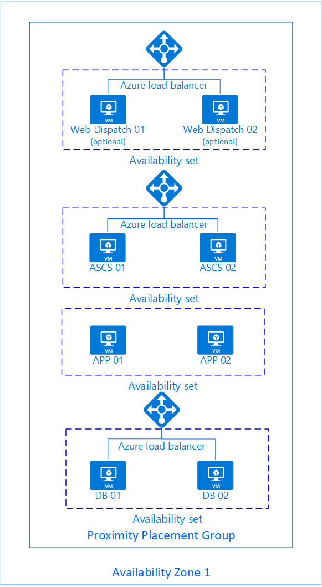
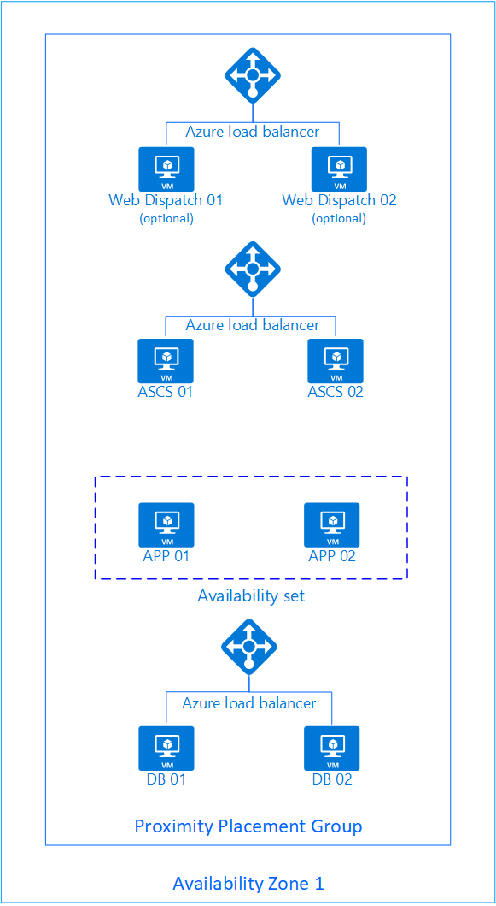

# **Overview**

The scripts and templates in this folder structure can be used to deploy the infrastructure for a SAP on Azure deployment.

Using the repository for your environments.

- Step 1: Fork the repository
- Step 2: Update the parameter files in serverTemplates\parameterFile directory to reflect your environment.
- Step 3: Edit the createNewEnvironment.ps1 file to define the first SAP system you want to deploy
  - SID
  - Define the shared resources (virtual network, subnet name, resource group for virtual network, application security group names)
  - Define the number of servers per tier and which images they use

## **Deployment options**

You can use the scripts to deploy environments for both development, test, quality assurance and production workloads.

Supported operating systems

- Suse
- RedHat
- Oracle Linux
- Windows

You can also use custom images.

### **Dev/Test**

These are environments with single server instances of each role (ascs, app, db, web dispatch (optional)) as is illustrated below:


### **QA/Prod**

The QA/Prod deployments are typically Highly Available environments having at least two servers of each type. The templates support three different deployment topologies of QA/Prod environments.

#### **Without Zone information**  

In this deployment the environment is deployed without providing availability zone as is illustated below. All components are deployed into the same proximity placement group ensuring proximity and low latency between the components.



#### **Zonal**  

In this deployment the environment is deployed into a single availability zone as is illustated below. As Availability Zones and Availability Sets are mutually exclusive all components except the application tier are deployed without availability sets. The application tier is deployed into an availability set that is associated with the proximity placement group thereby ensuring proximity and low latency between the components.



#### **Cross two availability zones**

In this deployment the environment is deployed across two availability zones as is illustated below. As Availability Zones and Availability Sets are mutually exclusive all components except the application tier are deployed without availability sets. The application tier is deployed into an availability set that is associated with the proximity placement group thereby ensuring proximity and low latency between the components.


## **Requirements**

This solution requires an existing VNet with subnets as well as existing Application Security Groups. There is a sample script *deployNetwork.ps1* in the deploymentScripts folder that can be used to create these.  

## **The folder structure**

The folder structure in the repo is designed to support an organisation that has a large number of SAP deployments.

### **/baseInfrastructure**

This folder contains the templates for the core infrastructure artifacts.

#### **asg.json**

This is the template for the Application Security Group deployment.

[](https://ms.portal.azure.com/#create/Microsoft.Template/uri/https%3A%2F%2Fraw.githubusercontent.com%2FAzure%2FSAP-on-Azure-Scripts-and-Utilities%2Fmaster%2FARMTemplates%2FbaseInfrastructure%2Fasg.json)

#### **keyvault.json**

This is the template for the key vault deployment.

[](https://ms.portal.azure.com/#create/Microsoft.Template/uri/https%3A%2F%2Fraw.githubusercontent.com%2FAzure%2FSAP-on-Azure-Scripts-and-Utilities%2Fmaster%2FARMTemplates%2FbaseInfrastructure%2Fkeyvault.json)

#### **network.json**

This is the template for the a sample network deployment.

[](https://ms.portal.azure.com/#create/Microsoft.Template/uri/https%3A%2F%2Fraw.githubusercontent.com%2FAzure%2FSAP-on-Azure-Scripts-and-Utilities%2Fmaster%2FARMTemplates%2FbaseInfrastructure%2Fnetwork.json)

#### **ppgavset.json**

This is the template for Proximity Placement Group and Availability Sets deployment.

### **/deploymentScripts**

This folder contains the deployment scripts for the templates.

#### **deployInfrastructure.ps1**

This is the deployment script for deploying the base infrastructure assets (asg.json).

#### **deployLandscape.ps1**

This is the placeholder deployment script for deploying the landscape. Do not run this, it will be updated when using the createNewLandscape.ps1 script.

#### **deployNetwork.ps1**

This is the  deployment script for deploying the sample network configuration.

### **/landScapes**

This is the root folder for all the landscapes. Each SAP deployment (SID) should be represented by a folder under this folder, for example /landScapes/S10, /landScapes/S11

#### **createNewEnvironment.ps1**

This is the script you can use to create the deployment artifacts for a new landscape.

### **/serverTemplates**

This is the  folder containing all the server templates. After forking the repository edit the template files to reflect your requirements (naming conventions etc).

```json
"sapMachineName": "[concat(variables('sapSystemIdLower'),'-',parameters('virtualMachineName'))]",
"networkInterfaceName": "[concat(variables('sapMachineName'),'-nic')]",
"publicIpAddressName": "[concat(variables('sapMachineName'),'-pip')]",
"avSetName": "[if(empty(parameters('availabilitySetName')), concat(variables('sapSystemIdLower'),'-app-avset'), parameters('availabilitySetName'))]",
"ppgName": "[if(empty(parameters('proximityPlacementGroupName')), concat(variables('sapSystemIdLower'),'-ppg'), parameters('proximityPlacementGroupName'))]",

```

### **/serverTemplates/parameterFiles**

This is the  folder containing all the server template parameter files. After forking the repository edit the parameter files to reflect your environment (Application Security Group Names, Resource Group name for Virtual Network, Virtual Network name etc.).

The parameter files contain placeholders [] that will be updated by the createNewEnvironment.ps1 file.

```json
"applicationSecurityGroupName": {
  "value": "[APPASG]"
},
"adminUsername": {
  "value": "[ADMINUSER]"
},
"adminPasswordOrKey": {
  "reference": {
    "keyVault": {
      "id": "[KeyVaultID]"
    },
    "secretName": "[PASSWORDSECRET]"
  }
},
"authenticationType": {
  "value": "password"
},
```

## **Server Templates**

### **anyDBProdVM.json**

This is the template for a database virtual machine. You can specify the database size in the parameter file to get the appropriate disk layout. The template has support for the following database sizes: "200", "500", "1024", "2048", "5120", "10240", "15360", "20480", "30720", "40960","51200"

This setting is specified in the *createNewEnvironment.ps1* file

```PowerShell
$DBSize = "51200"
```

[](https://ms.portal.azure.com/#create/Microsoft.Template/uri/https%3A%2F%2Fraw.githubusercontent.com%2FAzure%2FSAP-on-Azure-Scripts-and-Utilities%2Fmaster%2FARMTemplates%2FserverTemplates%2FanyDBProdVM.json)

### **APPVM.json**

This is the template for an application server virtual machine.

[](https://portal.azure.com/#create/Microsoft.Template/uri/https%3A%2F%2Fraw.githubusercontent.com%2FAzure%2FSAP-on-Azure-Scripts-and-Utilities%2Fmaster%2FARMTemplates%2FserverTemplates%2FAppVM.json)

### **ASCSVM.json**

This is the template for an ASCS virtual machine.

[](https://portal.azure.com/#create/Microsoft.Template/uri/https%3A%2F%2Fraw.githubusercontent.com%2FAzure%2FSAP-on-Azure-Scripts-and-Utilities%2Fmaster%2FARMTemplates%2FserverTemplates%2FASCSVM.json)

### **HanaDevVM.json**

This is the template for a development database virtual machine designed to host the Hana Server.

[](https://portal.azure.com/#create/Microsoft.Template/uri/https%3A%2F%2Fraw.githubusercontent.com%2FAzure%2FSAP-on-Azure-Scripts-and-Utilities%2Fmaster%2FARMTemplates%2FserverTemplates%2FhanaDevVM.json)

### **HanaProdVM.json**

This is the template for a database virtual machine designed to host the Hana Server.

[](https://portal.azure.com/#create/Microsoft.Template/uri/https%3A%2F%2Fraw.githubusercontent.com%2FAzure%2FSAP-on-Azure-Scripts-and-Utilities%2Fmaster%2FARMTemplates%2FserverTemplates%2FhanaProdVM.json)

### **WDVM.json**

This is the template for a Web Dispatch virtual machine.

[](https://portal.azure.com/#create/Microsoft.Template/uri/https%3A%2F%2Fraw.githubusercontent.com%2FAzure%2FSAP-on-Azure-Scripts-and-Utilities%2Fmaster%2FARMTemplates%2FserverTemplates%2FWDVM.json)

## **Creating a new deployment of a new SAP environment on Azure**

Navigate to the /landscapes folder and modify the values in the **createNewEnvironment.ps1** file.

Change the *[SUBSCRIPTIONID], [IMAGEGALLERYRGNAME], [IMAGEGALLERYRGNAME], [VAULTRG], [VAULTNAME], [IMAGENAME]* placeholders to reflect your environment.

Update the $SID and other relevant variables.

```PowerShell
$SID = "S40"
$region = "westeurope"

$subscriptionID = "[SUBSCRIPTIONID]"

#Shared resources
$virtualNetworkResourceGroupName = "demo-vnet-rg"
$virtualNetworkName = "demo-vnet"
$dbsubnetName = "db-snet"
$appsubnetName = "app-snet"
$appASG = "sap-app-asg"
$dbASG = "sap-db-asg"
$keyVaultName="sap-kv"
$adminUserName = "demoadmin"
$keyVaultSecretName="mypassword"

$HasPublicIP = $true
$WebDispatch = $true

#Get the Key Vault id
$kv = Get-AzKeyVault -VaultName $keyVaultName

if ($null -eq $kv) {
    Write-Error -Message "The key vault '" + $keyVaultName + "' does not exist"
    exit
}
$KeyVaultID = $kv.ResourceId

Add-Type -TypeDefinition @"
   public enum DBType
   {
      AnyDB,
      HanaDev,
      HanaProd
   }
"@

[DBType]$Database = [DBType]::HanaProd

#How many ASCS Servers are needed
$NumberOfASCSServers = 2
#Marketplace Template Information for the ASCS Server
#If ImageID is provided then these fields will be ignored
$ASCSPublisher = "suse"
$ASCSOffer = "sles-15-sp1"
$ASCSSKU = "gen1"
$ASCSSKUVersion = "latest"
#If you want to use a marketplace image $xxxxxImageID needs to be an empty string
#Custom image ID
$ASCSServerImageID = ""
#VM Size for the ASCS server
$ASCSVMSize = "Standard_D2s_v3"

#How many Application Servers are needed
$NumberOfAppServers = 2
#Marketplace Template Information for the Application Server
#If ImageID is provided then these fields will be ignored
$AppPublisher = "suse"
$AppOffer = "sles-15-sp1"
$AppSKU = "gen1"
$AppSKUVersion = "latest"
# Comment this out if you want to use Windows
# $AppPublisher = "MicrosoftWindowsServer"
# $AppOffer = "WindowsServer"
# $AppSKU = "2016-Datacenter"
# $AppSKUVersion = "latest"

$AppServerImageID = "/subscriptions/[SUBSCRIPTIONID]/resourceGroups/[IMAGEGALLERYRGNAME]/providers/Microsoft.Compute/galleries/[IMAGEGALLERYNAME]/images/[IMAGENAME]/versions/[VERSIONNUMBER]"

#VM Size for the application server
$AppVMSize = "Standard_D4s_v3"

#How many DB Servers are needed
$NumberOfDatabaseServers = 2
#Marketplace Template Information for the Database Server

#If ImageID is provided then these fields will be ignored
$DBPublisher = "suse"
$DBOffer = "sles-15-sp1"
$DBSKU = "gen1"
$DBSKUVersion = "latest"
#VM Size for the database server
#If you want to use a marketplace image $xxxxxImageID needs to be an empty string
#Custom image ID
$DBServerImageID = ""
#VM Size for the database server
$DBVMSize = "Standard_M64s"

#Is High Availability required, if so the the servercount(s) will be 2 or higher
$SAPHA = $true
#If you need Web dispatchers set the $WebDispatch to true
$WebDispatch = $false
```

### **Retrieving IDs, etc for the supporting services**

#### Get the Image SKUs available in a region

```PowerShell
$Region = "westeurope"
Get-AzVMImageOffer -PublisherName Oracle -Location $Region

Get-AzVMImageOffer -PublisherName Redhat -Location $Region

Get-AzVMImageOffer -PublisherName MicrosoftWindowsServer -Location $Region

Get-AzVMImageOffer -PublisherName Suse -Location $Region

#Get the SKUs
Get-AzVMImageSku -PublisherName Oracle -Location $Region -Offer Oracle-Linux

Get-AzVMImageSku -PublisherName RedHat -Location $Region -Offer RHEL-SAP-HANA

Get-AzVMImageSku -PublisherName MicrosoftWindowsServer -Location $Region -Offer WindowsServer

Get-AzVMImageSku -PublisherName Suse -Location $Region -Offer sles-15-sp1

#Get the Image details
Get-AzVMImage -PublisherName Oracle -Location $Region -Offer Oracle-Linux -Skus 77

Get-AzVMImage -PublisherName RedHat -Location $Region -Offer RHEL-SAP-HANA -Skus 7.3

Get-AzVMImage -PublisherName MicrosoftWindowsServer -Location $Region -Offer WindowsServer -Skus 2016-Datacenter

Get-AzVMImage -PublisherName Suse -Location $Region -Offer sles-15-sp1 -Skus gen1

```

#### Get the VM SKU sizes available in a region

```PowerShell
$Region = "westeurope"
Get-AzVMSize -Location westeurope

#List all 8 core SKUs

Get-AzVMSize -Location westeurope | Where-Object {$_.NumberOfCores -eq 8}

```

Validate the SKU size using [SAP Note 1928533](https://launchpad.support.sap.com/#/notes/1928533)

#### Get the Azure Key Vault ID

Open the key vault in the portal and choose Resource ID from the properties tab for your keyvault


```PowerShell
$ResourceGroup = "sharedserviced"
$VaultName = "corp-vault"

$id = (Get-AzResource -Name $VaultName -ResourceGroupName $ResourceGroup -ResourceType Microsoft.KeyVault/vaults).ResourceId

Write-Host "Key Vault ID" $id
```

#### Get the Image template ID

```PowerShell
$ResourceGroupName = "SharedImagesUS"
$ImageName = "nwImage20200111-01"

$id = (Get-AzResource -Name $ImageName -ResourceGroupName $ResourceGroupName -ResourceType Microsoft.Compute/galleries/images).ResourceId

Write-Host "Image ID" $id

```

### **Creating the deployment artifacts for a new SAP environment**

Update and execute the *createNewEnvironment.ps1* script. It will create a folder underneath the "Landscapes" folder and copy all the required deployment artifacts there. The folder will be have the same name as the SID in the *createNewEnvironment.ps1* script.

### **Update the server parameter files SID.xxxx.paramater.json and change the following parameters (if needed):**

Navigate to the new folder, this folder will contain a deployment script and the parameter files required to deploy the availability sets and the proximity placement group as well as parameter files (Web Dispatch, ASCS, application and database). If needed update the files to reflect your requirements.

- availabilitySetName, for example: "availabilitySetName": {"value": "S04-app-avset"}
- availabilitySetNameDB, for example: "availabilitySetNameDB": {"value": "S04-db-avset"}
- proximityPlacementGroupName, for example: "proximityPlacementGroupName": {"value": "S04-ppg"}
- virtualMachineSize, for example: "virtualMachineSize": {"value": "Standard_E4s_v3"}
- PrivateIP, for example: "PrivateIP": {"value":["10.0.0.15","10.0.0.16"]}
- HasPublicIP, for example: "HasPublicIP": {"value": false}
- virtualNetworkResourceGroupName, for example "virtualNetworkResourceGroupName": { "value": "VNetRG" }
- virtualNetworkName, for example "virtualNetworkName": { "value": "prodvnet" }
- subnetName, for example "subnetName": { "value": "apps" }
- imageReference, for example: "imageReference": {"value": {"publisher": "suse","offer": "SLES-SAP","sku": "12-sp4","version": "latest"}}
- imageID, for example: "imageID": {"value": "/subscriptions/xxxxxxxx-xxxx-xxxx-xxxx-xxxxxxxxxxxxx/resourceGroups/SharedImagesUS/providers/Microsoft.Compute/galleries/CorpImageGallery/images/nwImage20200111-01/versions/0.24089.43435"} see above
- Tags, for example "vmTagValues" : {"value" : "{ System": "SAP", "$perfOptimizationLevel": "1" }"
- Zonal support, for instance {"value" : ["1"]} will deploy the servers in Availability Zone 1, {"value" : ["1","2"]} will deploy the servers across two Availability Zones, 1 and 2

and any other parameter values unique for the deployment.

Ensure that the parameters in the *deployLandscape.ps1* script reflect your environment.

```PowerShell
$ResourceGroupName = "S22-rg"
$location = "northeurope"
$subscriptionID = "xxxxxxxx-xxxx-xxxx-xxxx-xxxxxxxxxxxx"
$SID = "S22"
```

Deploy the environment using the *deployLandscape.ps1* file.  

**Note** The templates expect that the virtual network, the subnets and the application security groups already exist
