# How to Migrate a Highly Available SAP System in Azure from Availability Set to Availability Zone

SAP is a business-critical system for many companies. Business continuity (BC) and high availability (HA) is a must have for many companies ruining SAP.

**Availability set** is the first HA concept for SAP systems in Azure, that protect an application against unplanned downtime of a physical server and racks inside **ONE data center (DC)**. It also minimizes planned maintenance downtime. Two or more VMs that as parts of an availability set are automatically distributed across the so-called [fault domains](https://docs.microsoft.com/en-us/azure/virtual-machines/availability-set-overview) (physical racks), and [update domains](https://docs.microsoft.com/en-us/azure/virtual-machines/availability-set-overview) to avoid service outage due to host failure or maintenance activities (only one instance is taken down at the time for the planned maintenance).

In a highly available SAP system, we have these architectural layers:

  - **SAP Application Servers**
    
    SAP application servers are redundant components. You need at least two SAP application servers deployed on two VMs.

  - **DBMS clusters**

    DBMS is a unique component and so-called single point of failure (SPOF).  
    DBMS can be protected with:
    
      - Application cluster deployed on two VMs like **Windows Failover
        cluster** (a DB example is SQL Server AlwaysOn) or **Pacemaker
        cluster on Linux** (a DB example is SAP HANA)
    
      - Or DB native clustering technology – an example is **Oracle Data
        Guard.**

  - **SAP Central Services Clusters**  
    SAP central services for ABAP based systems (ASCS) or Java based system SCS, is also a **Single Point of Failure** (**SPOF**) component, and it's protected with either **Windows Failover cluster** or **Pacemaker cluster on Linux**.

  - **SMB or NFS File Share cluster** (if it's used)  
    SAP file shares like SAPMNT or SAPTRANS are also SPOFs.

Each SAP layer is placed in its own separate availability set. **SLA of an Availability Set is 99,95 %**.

Still, **Availability Set does not protect an SAP application from data center failure**.

To protect an SAP system against data center (DC) failure, you must use a new concept called **Azure Availability Zones**. An [Availability Zone](https://docs.microsoft.com/en-us/azure/availability-zones/az-overview#availability-zones) is a high-availability offering that protects your applications and data from datacenter failures. Availability Zones are unique physical locations within an Azure region. Each zone is made up of one or more datacenters equipped with independent power, cooling, and networking. To ensure resiliency, there's a minimum of three separate zones in all enabled regions. The physical separation of Availability Zones within a region protects applications and data from datacenter failures.

In Azure zone, a one fault domain, and one update domain, is complete data center (DC). VMs belonging to different SAP layers are distributed across two availability zones. Azure zone deployments offer industry best **99.99% VM uptime SLA**. This higher availability has attracted customers to migrate from Availability Sets to Availability Zones implementation.

## New Installation or Migration to Zones

If you have a new green field project in Azure, you can immediately decide for zonal implementation, if your desired Azure region has Availability Zones offering. Check official SAP on Azure document [SAP workload configurations with Azure Availability Zones](https://docs.microsoft.com/en-us/azure/virtual-machines/workloads/sap/sap-ha-availability-zones) and [Azure proximity placement groups for optimal network latency with SAP
applications](https://docs.microsoft.com/en-us/azure/virtual-machines/workloads/sap/sap-proximity-placement-scenarios).

On the other hand, if you already implemented SAP HA using Azure Availability Sets, you may decide to **migrate to the zonal HA**. This paper describes the migration process in detail. The entire **procedure ensures that you experience minimum or almost no downtime for your SAP system during the migration to zones**\!

**IMPORTANT:**
*This white paper does **NOT** cover migration of a non-HA SAP system to an HA SAP system in the zones.*


## Modernization and Simplification of your SAP HA Architecture

Azure is continuously innovating and offering a new SAP on Azure reference architecture. New cloud services can be used as replacement for classic infrastructure solutions. For example, a file share cluster solution installed across two or three VMs can be replaced by native Azure File Share solution for SMB and NFS.

Such cloud SaaS services are offering:

  - Simplification of SAP HA architecture.

  - Simplification of operations of highly available SAP systems.  
    Cloud services are cloud SaaS service, therefore there's no need to manage it.

  - Often, such cloud services can also lower cost compared to classic infrastructure solutions.

This whitepaper will recommend how to replace some existing older HA components with new one.

## Source SAP HA Architecture in Azure Availability Set 

Before migration, source SAP HA architecture with Availability Set can look like this:  

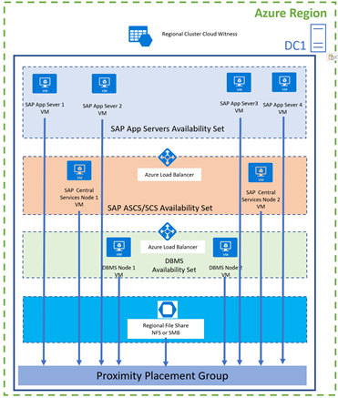  

There can be some variation based on the Windows or Linux OS, cluster solution, DBMS type, HA file share type etc.

In a highly available SAP system with Availability set we have these specifics:

  - Each SAP layer:
    
      - SAP Application Servers
    
      - SAP Central Services Cluster
    
      - DBMS Cluster

    is placed in its own Availability Set.

  - For clustered SAP ASCS/SCS and/or DBMS layer is using Azure Internal Load Balancer – either Basic or Standard SKU.

  - The use of regional file share cloud service – like regional Azure NetApp Files (ANF)

  - All VMs are part of the same **Proximity Placement Group (PPG)** ensuring all VMs are physically close to each other (same Data Center) and have low network latency between them.

  - The use of cloud witness for cluster quorum/fencing.
    
      - on Windows cluster it's Cloud Witness
    
      - On RHEL or SLES is Azure fence agent 

## Target SAP HA Architecture in Azure Zones 

After migration, target SAP HA architecture in Availability Zone can look like this:

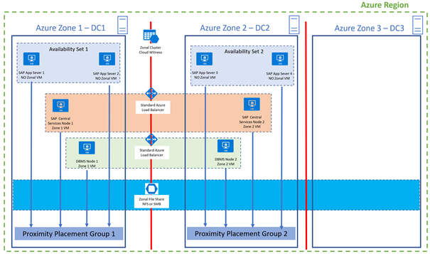

There can be some variation based on the Windows or Linux OS, cluster being used, DBMS type, HA file share type.

What is specific if following:

  - SAP Central services and DBMS are **zonal VMs**.

  - All VMs in one zone are members of proximity placement group in that zone.

  - If virtual host name is used for clustered SAP ASCS/SCS or DBMS, then typical you have Azure Internal Load Balancer which **must be** a **Standard** Azure ILB.            

**NOTE:**  **Standard** **Azure ILB is zone redundant**


  - We're using cloud witness for cluster quorum/fencing.
    
      - on Windows cluster is Zonal Cloud Witness
    
      - On RHEL Pacemaker cluster is [Azure fence agent](https://docs.microsoft.com/en-us/azure/virtual-machines/workloads/sap/high-availability-guide-rhel-pacemaker#create-stonith-device)
    
      - On SLES Pacemaker cluster can be used:
        
          - [SBD with an iSCSI target server](https://docs.microsoft.com/en-us/azure/virtual-machines/workloads/sap/high-availability-guide-suse-pacemaker#sbd-with-an-iscsi-target-server)
        
          - [SBD with an Azure shared disk](https://docs.microsoft.com/en-us/azure/virtual-machines/workloads/sap/high-availability-guide-suse-pacemaker#sbd-with-an-azure-shared-disk)
        
          - [Azure fence agent](https://docs.microsoft.com/en-us/azure/virtual-machines/workloads/sap/high-availability-guide-suse-pacemaker#use-an-azure-fence-agent-1)

  - SAP application servers VMs are NOT zonal VMs one but have their own Azure Availability Set. By using PPG, application server VMs are indirectly placed in the same zone as the zonal anchor VMs of either SAP ASCS/SCS VM or DBMS VM.

Another variation of a target zonal architecture can look like this:

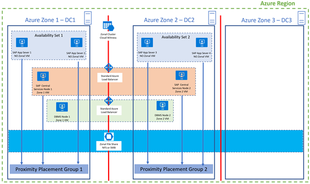

Here, **DBMS** layer is **NOT** in the **PPG**.

**IMPORTANT:** This variation is **strongly recommended!** Reasons are explained later in the document. 

More details can be found in the official guide [Proximity placement groups with zonal deployments](https://docs.microsoft.com/en-us/azure/virtual-machines/workloads/sap/sap-proximity-placement-scenarios#proximity-placement-groups-with-zonal-deployments).

## Networking considerations 

One VNET can stretch all zones in one region. Also, each subnet can stretch all zones in one region.

In this example each SAP layer has its own subnet:

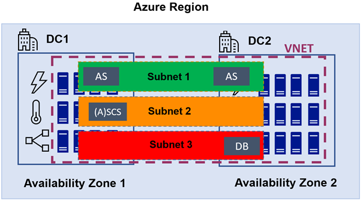

Off course, you can have just one subnet for all layers of your SAP system, which stretch zones in one region.

By stretching subnet across zones, clustered instances that use **virtual host name** like SAP ASCS/SCS and DBMS instances, can use **the same IP address** regardless of the zone where they run, and SAP application servers won't have an issue to reconnect it after the failover.

## Combine Availability Sets and Availability Zones with Proximity Placement Groups

You can deploy SAP application servers VMs as zonal VMs. That would be OK if we have just one SAP application server in each zone (so totally two SAP application servers). Typical you would have more VMs with SAP application servers. In each zone you would have two or more VMs for SAP application servers.  
  
If those SAP app servers VMs in one zone, are zonal VMs, then ALL those VMs are in the same (zonal) fault and update domain. This means that theoretically, all SAP application servers VMs could land on the same physical host. Unplanned or planned downtime of that hypervisor host can bring down all the SAP application server VMs of that zone.

To solve this issue, you would use an Availability Set, which would spread VMs across different fault domains and update domains, therefore across different physical host.

As it isn't possible to combine zones and availability set, we're taking this approach:

  - Deploying SAP Application server VMs as normal regional VM into an
    Availability Set

  - regional VMs can land into any DC, in any zone, even DC/Zone far away from DBMS server and create more network latency between the SAP app servers on one hand, and DBMS and SAP ASCS/SCS VMs on another hand.

  - to force SAP app servers VMs to be deployed to the same zone (and same DC) as DBMS and/or SAP ASCS/SCS VMs (and have good network latency) we're using Proximity Placement Group as a glue.

In that way we ensure that all SAP application servers VMs are in the same zone (and same DC) as DBMS and/or SAP ASCS/SCS VMs, and we also get the benefits of Availability Set fault and update domains.

For more information you can check official SAP on Azure document [Combine availability sets and Availability Zones with proximity placement groups](https://docs.microsoft.com/en-us/azure/virtual-machines/workloads/sap/sap-proximity-placement-scenarios#combine-availability-sets-and-availability-zones-with-proximity-placement-groups).

## High Level Migration Steps 


**IMPORTANT:**
*Before you execute the migration and scripts on the productive SAP system, make sure to test it on the test VMs. Ideally, a HA SAP system is also installed on the test VMs. Make sure that test VMs have the same configuration as productive VMs. That means they should have the same VM SKU, disk types, disk numbers and sizes, same number of NIC cards, same subscription, load balancers etc. If possible, place test VMs inside of the same subnet as productive VMs and in the same resource groups.*

High level migration steps are the following:

  - **Prerequisites Checks**  
      
    Do prerequisite check - if specific region supports zones, identify two zones that are close for good network latency, check if VM types are available in the needed zones.

  - **Azure VM Disks**  
      
    Current procedure will work for the Azure managed disks, either premium or standard.

  - **Standard Azure Internal Load Balancer**  
      
    If you use an Azure Internal Load Balancer, check that it's a **Standard** one and not **Basic**. If you have a Basic ILB, you need to **migrate ILB from Basic to Standard**.

  - **Proximity Placement Groups (PPGs)**  
    Create two new **proximity placement groups** (**PPGZone1** and **PPGZone2**) for each zone.

  - **Azure Availability Sets for SAP application Servers**  
    Create two new **Azure Availability Sets** for each zone, for SAP application servers, and configure availability sets to use corresponding PPGs.

  - **Preparation of PowerShell Environment and Scripts**

    To migrate SAP layers to Zones, you can use PowerShell scripts, which you need to download first.

  - **DBMS Layer**  
      
    Migrate DBMS (cluster) VMs to respected zone and proximity placement group:
    
      - DBMS **node 1** to **zone 1** and **PPGZone1**
    
      - DBMS **node 2** to **zone 2** and **PPGZone2**

      **IMPORTANT:**
       It is important to **move DBMS VMs FIRST** into a zone with respected PPG\! DBMS VM is an anchor VM, which will pool all other VMs (via PPG) to the same zone (and DC).
    

  - **SAP Central Services Layer**  
      
    Migrate SAP ASCS/SCS cluster VMs to respected Zone and proximity placement group:
    
      - SAP ASCS/SCS **node 1** to **zone 1** and **PPGZone1**
    
      - SAP ASCS/SCS **node 2** to **zone 2** and **PPGZone2**

  - **SAP File Share Layer**  
      
    File share is used for SAPMNT file share, SAP ASCS/SCS files, SAPTRANS files:
    
      - If you use VM based solutions for highly available file share ([SUSE Linux with Pacemaker + DRBD](https://docs.microsoft.com/en-us/azure/virtual-machines/workloads/sap/high-availability-guide-suse#setting-up-a-highly-available-nfs-server),
        [Red Hat GlusterFS](https://docs.microsoft.com/en-us/azure/virtual-machines/workloads/sap/high-availability-guide-rhel#setting-up-glusterfs),
        [Windows Cluster with Generic File share and SIOS](https://docs.microsoft.com/en-us/azure/virtual-machines/workloads/sap/sap-high-availability-guide-wsfc-shared-disk#shared-disks-in-azure-with-sios-datakeeper)), then you need to move the two VMs to the respective zone and PPG.
    
      - Alternative is to use Zonal file share cloud services like:
        
          - [Azure Files for NFS](https://techcommunity.microsoft.com/t5/running-sap-applications-on-the/deploy-sap-ascs-ers-with-azure-files-nfs-v4-1-shares/ba-p/2038320) – used by Linux Pacemaker cluster.
        
          - Azure Files for SMB – used by Windows Failover Cluster.
        
          - Azure Shared Disk – used by Windows Failover Cluster.

        As Azure Files for NFS and SMB as well as Azure Shared Disk are cloud services, which simplify management, they're recommended solutions.

  - **SAP Application Servers Layer**

    Migrate:

      - Part of SAP application servers to **Availability Set 1** and **PPGZone1** (indirectly to **zone 1**)

      - Part of SAP application servers to **Availability Set 2** and **PPGZone2** (indirectly to **zone 2**)

  - **Windows Cloud Witness Consideration**

  - **Linux Pacemaker Fencing Consideration**

All steps are being discussed in detail below.

## Prerequisite Checks 

Before you start, you must check a few things:

  - **Does your Azure region support zones?**

    Not every Azure region support Azure zones. Check [here](https://azure.microsoft.com/en-us/global-infrastructure/geographies/#overview) for regional zone support.

  - **Choose the two closest zones**

    In an Azure region, there three zones. In one Azure region distance between each zone will be different to the zones in another region.  
      
    To get the smallest network latency, which is important for overall SAP performance, make sure to choose the two closest zones. Check this blog [How to choose correct Availability Zones for SAP Application cross-zone deployment](https://techcommunity.microsoft.com/t5/running-sap-applications-on-the/how-to-choose-correct-availability-zones-for-sap-application/ba-p/1886431) for more information.  
          
    **IMPORTANT:**
     In the **same** Azure region, zone numbers (and data center physical locations) can be different to zone numbers (and data center physical locations) in another Azure subscription. Therefore, for each Azure subscription, in the same region, you need to do separate exercise to find the closest zones e.g., zone numbers.
    

  - **Are your existing VM types also available in the desired zones?**

    Some VM type might be available in an Azure region, but not in the desired zone. That might be the case with Mv1 or Mv2 VMs. Check that all VM types that you use are also available in the desired zones.

  - **Are your desired VM types enabled in your Azure subscription and zone?**

    If a VM type is available in the desired zones, check that is this VM type enabled in your Azure subscription. If the VM type isn't enabled in the subscription, you need to open an Azure support case and request enablement.  
      
    You can use this PowerShell command to see if VM type is available in the zones, and if it's enabled for your subscription:

    ```powershell
    Get-AzComputeResourceSku | where {$\_.Locations.Contains("westeurope")  -and $\_.LocationInfo\[0\].Zones -ne $null -and $\_.ResourceType.Equals("virtualMachines")}
    ```
    
    | ResourceType | Name | Location  | Zones | Restriction | Capability | Value | Comment |
    | --- | --- | --- |--- | --- | --- | --- | --- |
    | virtualMachines | Standard_M32ls | westeurope | {1, 2, 3} | | MaxResourceVolumeMB  | 1024000 | Available in ALL Zones |
    | virtualMachines | Standard_D2 | westeurope | {1, 2} | | MaxResourceVolumeMB  | 1024000 | Available in Zones 1 & 2 |
    | virtualMachines | Standard_E4s | westeurope | 1 | NotAvailableForSubscription | MaxResourceVolumeMB  | 344064 | Available in Zone 1 but not enabled in this subscription |


    In upper example:

    - **Standard\_M32ls** VM type  
    Is available in all three zones {1, 2, 3} and are enabled for the subscription.

    - **Standard\_D2** VM type  
    Is available in two zones {1, 2} and are enabled for the subscription.

    - **Standard\_E4s** VM type  
    Is available in zone {1}, and it's NOT enabled for the subscription.  
        
     **NOTE:**
     To enable it for the subscription you need to open an Azure support ticket and request enablement.    

  - **Make sure that DBMS VM type and SAP application layer VM type (used for SAP ASCS/SCS and SAP application servers) can be deployed in desired Zone and can be combined with PPG.**  

    Each Azure zone typical consists of multiple DCs, which are very close to each other. Network latency between two DCs in the same zone is typically low.  
      
    When you use PPG in Zones for VMs of different SAP layers, PPG is forcing all VMs to be placed not just in the same zone, but also in the same data center (DC).  
      
    What can happen is that some VM types that are available in some zone, but not in all DC of that zone.  
      
    For example:
    
      - DBMS M-Series is available in zone 2 and in DC1 of zone 2.
    
      - App Server and ASCS/SCS layer Dv3 VM type is available in DC2 of zone 2.

    After you deploy the first DBMS VM type in a PPG, and you try to deploy / move SAP app server and SAP ASCS/SCS VM and put in the existing PPG you'll get an **allocation error**. PPG is forcing Dv3 to be deployed in DC1 of zone 2, and as compute hardware for Dv3 isn't available in DC1 of zone 2 but only in DC2 of zone 2, you’ll get an allocation error.

    You can address this and check if all VM types are available also in the DC and zone, is following:

    - Deploy new zonal VM with desired DBMS type with PPG.

    - Deploy new zonal VM with SAP ASCS/SCS layer type and put it in desired PPG.

    - Deploy new non-zonal VM with SAP application server layer type and put it in desired PPG.

    - If everything works, desired SAP application layer type is available in a zone and DC where DBMS is located.

    - If you get allocation failure:
    
      - Try to deploy VM with another VM type that is certified for SAP application layer. If you're successful, you can use a new VM type for your SAP application layer.  
        If you would use PowerShell cmdlets to migrate the VMs, you can use PowerShell cmdlet parameter **-NewVMSize** to specify new VM size during the migration.
    
      - If you would still love to keep the original / desired VM size, which isn't available in the DBMS data center, you could:
        
          - Deploy DBMS in Zones **without PPG** with VM type 1.
        
          - Deploy zonal SAP ASCS/SCS VMs with PPGs with VM type 2.
        
          - Deploy SAP app servers in Availability Sets and PPGs with VM type 2.
        
          - Here SAP application layer (SAP ASCS/SCS and application servers) will be in DC1 and DBMS layer in DC2, and both in the same zone, so network latency will be good.

        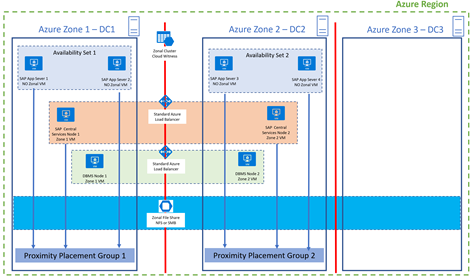

  - Assumption is that you use Azure **managed disks** (**Premium** or **Standard**).

## Standard Azure Internal Load Balancer (ILB)  

In your HA setup for clustered SAP ASCS/SCS instance or DBMS instance, you'll have an Azure internal load balancer used for SAP ASCS/SCS and DB (depends on DBMS type and cluster technology) virtual host IP address.  
  
There are two ILB SKUs - **Basic** and **Standard**. In an Availability Set you can use either Basic or Standard (Standard is recommended). But **in Availability Zones you MUST use Standard ILB**, because only **Standard ILB is zone redundant**.  
  
If you use Basic ILB, you need to convert it to Standard ILB before you move the VMs.

 **NOTE:**
 Some DBMSs use their own clustering technologies that don't require Azure Internal Load Balancer. An example is Oracle Data Guard.

### Upgrade Basic ILB to Standard 

Here you [find instruction to upgrade](https://docs.microsoft.com/en-us/azure/load-balancer/upgrade-basic-standard):

  - [Upgrade Azure Internal Load Balancer- No Outbound Connection Required](https://docs.microsoft.com/en-us/azure/load-balancer/upgrade-basicinternal-standard)

  - [Upgrade Azure Internal Load Balancer - Outbound Connection Required](https://docs.microsoft.com/en-us/azure/load-balancer/upgrade-internalbasic-to-publicstandard)

You need to plan a short downtime for your SAP ASCS/SCS instance or DBMS instance, as the script will create a new standard ILB, and move the configuration and IP to the new ILB.

## Create Proximity Placement Groups (PPGs)

Create two **new** proximity placement groups for each zone.

These PPGs can be named for example:

  - **PPGZone1**

  - **PPGZone2**

## Azure Availability Sets with PPG for SAP application Servers  

Create two new **Azure Availability Sets** for each zone, for the SAP application servers.

These Azure Availability Sets can be named for example:

  - **Av-Set-Zone1**  
    > [!IMPORTANT]
    > Configure this **Av-Set-Zone1** to use **PPGZone1**.    

  - **Av-Set-Zone2**      
    > [!IMPORTANT]
    > Configure this **Av-Set-Zone2** to use **PPGZone2**.

## Prepare PowerShell Environment and Scripts

To migrate SAP layers to zones, you can use PowerShell scripts, which you need to download first. You need a PowerShell runtime environment of at least 5.1.

You can check PowerShell version by running this command:  
  
```powershell
$PSVersionTable.PSVersion
```

| Major | Minor | Build  | Revision |
| --- | --- | --- |---| 
| 5 | 1 | 19041 |610 |

All PowerShell modules are part of the module called **SAPAZurePowerShellModules**. This PowerShell module is available in the PowerShell Gallery.

You can find this PowerShell module by running this PowerShell command:  

```powershell
Find-Module SAPAZurePowerShellModules
```

| Version | Name | Repository  | Description |
| --- | --- | --- |---| 
| 0.1.20 | SAPAzurePowerShellModules | PSGallery |SAP on Azure PowerShell Modules used for automation. |


You can install this module by running this PowerShell command:

```powershell
Install-Module SAPAZurePowerShellModules -Verbose
```

When asked *Are you sure to install the modules from ‘PSGallery’?*, answer with: **Y**.

To load the PowerShell module, run this PowerShell command:

```powershell
Import-Module SAPAZurePowerShellModules -Verbose
```

###  Move-AzVMToAzureZoneAndOrProximityPlacementGroup command to move VM to the Availability Zone and PPG

PowerShell cmdlet `Move-AzVMToAzureZoneAndOrProximityPlacementGroup` will move the VM to the Availability Zone.

You'll use this command to move:

  - DBMS layer to Zones

  - SAP Centrale services layer to the zones

  - HA File Share cluster - If you're using it for SAPMNT and SAPTRANS file shares, SAP ASCS/SCS files

You'll call the cmdlet like this:

```powershell
Move-AzVMToAzureZoneAndOrProximityPlacementGroup -VMResourceGroupName GOR-M-SERIES -VirtualMachineName dbms-node-2 -AzureZone 2 -PPGResourceGroupName gor-ppg-group -ProximityPlacementGroupName PPGZone2 -AzureInternalLoadBalancerResourceGroupName gor-lb-group -AzureInternalLoadBalancerName dbms-ilb

```
Command `Move-AzVMToAzureZoneAndOrProximityPlacementGroup` will do the following:

  - It will make sure that VM is running, so that it can collect all the VM information.

  - It will check that Azure ILB exists and that is Standard type.

  - It will check that PPG exists.

  - It will check that PPG region is the same as the VM region.

  - It will check if the desired VM SKU is available in the target region.

  - If there are existing (anchor) VMs associated with PPG, in case VMs are zonal, it will check that anchor VM zone is the same as the target zone of the VM being migrated.

  - It will stop VM.

  - It will create an OS and data disk snapshots.

  - From disk snapshots it will create a new zonal managed disk in desired zone.

  - It will delete VM (VM definition will be deleted but not the OS and data disk, and not the network cards etc.).

  - New VM will be created with NEW zonal OS and data managed disks.

  - VM name will be the same.

  - VM tags will be copied to the new VM.

  - Existing network cards will be attached.

  - VM will be put to specified PPG.

  - VM will be added to the standard load balancer (if specified)

You can get help information by running in PowerShell:

```powershell
help Move-AzVMToAzureZoneAndOrProximityPlacementGroup -Full
```
 **TIP:**
 PowerShell cmdlet will ask you for confirmation to stop VM, remove VM definition. If you want to skip confirmation, specify parameter extra parameter `-Force` in the cmdlet. If you like or need to change the VM size, specify parameter extra parameter `-NewVMSize <DesiredVMSize>`  in the cmdlet.

New zonal disks will be created from snapshots in the same resource group. Default behavior is that new zonal disk naming convention will be `<OriginalDiskName>-z<ZoneNumber>`.  
  
If you would like to keep the same disk names, use an extra flag `-KeepSameDiskNames`. Here, out of snapshot will be created a copy of the original disk with naming convention `<OriginalDiskName>-orig<FreeNumber>`, original disk will be deleted (as it isn't possible to have two disks with the same name in the same resource group), and new zonal disk with the name `<OriginalDiskName>` will be created from the snapshot.

 **IMPORTANT:**
 PowerShell cmdlet `Move-AzVMToAzureZoneAndOrProximityPlacementGroup` can also be used to move VM from one zone to another zone.

### Move-AzVMToAvailabilitySetAndOrProximityPlacementGroup Command to Move VM to the New Availability Set and PPG

PowerShell command `Move-AzVMToAvailabilitySetAndOrProximityPlacementGroup` will move the VMs to the new Availability Set and PPG.

You'll use this command to move:

  - SAP Application Servers to the NEW Availability Seta and PPG

You'll call the cmdlet like this:

```powershell
Move-AzVMToAvailabilitySetAndOrProximityPlacementGroup -VMResourceGroupName SAPResourceGroup -VirtualMachineName sap-app-server-vm -AvailabilitySetName Av-Set-Zone1 -PPGResourceGroupName RG-PPGZone1 -ProximityPlacementGroupName PPGZone1
```

Cmdlet `Move-AzVMToAvailabilitySetAndOrProximityPlacementGroup` will do the following:

  - It will check that PPG exists.

  - It will check that Availability Set exists and that is configured to use specified PPG.

  - It will make sure that VM is running, so that it can collect all the VM information.

  - It will stop VM.

  - It will delete VM (VM definition will be deleted but not the OS and data disk, and not the network cards etc.).

  - New VM will be created with NEW specified Availability Set and PPG.

  - Existing OS and data disks will be reattached to the new VM.

  - VM name will be the same.

  - VM tags will be copied to the new VM.

  - Existing network cards will be attached.

You can get help information by running in PowerShell:

```powershell
help Move-AzVMToAvailabilitySetAndOrProximityPlacementGroup -Full
```

The only way to move the VM to the new Azure Availability Set is to recreate the VM and specify a new Availability Set.

 **IMPORTANT:**
 **VM** and **Availability Set** MUST be in the same Azure resource group. **Proximity Placement** group can be placed in another resource group, different from the resource group of the VM and Availability Set.

 **TIP:**
  PowerShell cmdlet will ask you for confirmation to stop VM, remove VM definition. If you want to skip confirmation, specify parameter additional parameter -Force in the cmdlet.
  If you like or need to change the VM size, specify parameter extra parameter -NewVMSize <DesiredVMSize> in the cmdlet. 

### Move-AzSAPApplicationServerVMToAzureAvaialbilitySetAndOrProximityPlacementGroup command to move VM to the new Availability Set and PPG and Stop / Start SAP Application Server

`Move-AzSAPApplicationServerVMToAzureAvaialbilitySetAndOrProximityPlacementGroup` cmdlet, compared to the `Move-AzVMToAvailabilitySetAndOrProximityPlacementGroup` cmdlet, is offering full automation when migrating an SAP application server, e.g., it's also covering SAP application server itself in addition to handling the VM.
  
It will do the following:

  - It will list all SAP instances and display their status.

  - It will gracefully stop specified SAP application server, allowing the SAP user to finish the work and SAP batch jobs to finish inside of specified soft shutdown time.

  - It will check that PPG exists.

  - It will check that Availability Set exists and that is configured to use specified PPG.

  - It will make sure that VM is running, so that it can collect all the VM information.

  - It will stop VM.

  - It will delete VM (VM definition will be deleted but not the OS and data disk, and not the network cards etc.).

  - New VM will be created with NEW specified Availability Set and PPG.

  - Existing OS and data disks will be reattached to the new VM.

  - VM name will be the same.

  - VM tags will be copied to the new VM.

  - Existing network card will be attached.

  - VM will be started.

  - SAP application server will be started.

  - It will list all SAP instances and display their status.

On **Linux OS** you'll call the cmdlet like this:

```powershell
$SAPSID = "TS1"

$SAPInstanceNumber = 3

$SAPApplicationServerGracefullSoftShutdownTimeInSeconds = 30

$VMResourceGroupName = "gor-linux-eastus2"

$VirtualMachineName = "ts2-di2"

$AvailabilitySetName= "TS1-AV-SET-ZONE2"

$PPGResourceGroupName = "gor-linux-eastus2-2"

$ProximityPlacementGroupName = "TS1-PPG-Zone2"

Move-AzSAPApplicationServerVMToAzureAvaialbilitySetAndOrProximityPlacementGroup -SAPSID $SAPSID -SAPInstanceNumber $SAPInstanceNumber -SoftShutdownTimeInSeconds $SAPApplicationServerGracefullSoftShutdownTimeInSeconds -VMResourceGroupName $VMResourceGroupName -VirtualMachineName
$VirtualMachineName -AvailabilitySetName $AvailabilitySetName -PPGResourceGroupName $PPGResourceGroupName -ProximityPlacementGroupName $ProximityPlacementGroupName
```

On **Windows OS** you'll call the cmdlet like this:

```powershell
$SAPSID = "PR2"

$SIDADM = $SAPSID.ToLower() + "adm"

# Get the <sid>adm password in secure way

$SAPSIDADMUserCred = Get-Credential -UserName $SIDADM -Message 'Enter Password:'

$SAPInstanceNumber = 2

$SAPApplicationServerGracefullSoftShutdownTimeInSeconds = 30

$FullPathToSAPControl = "C:\\usr\\sap\\PR2\\D02\\exe\\sapcontrol.exe"

$VMResourceGroupName = "gor-linux-eastus2-2"

$VirtualMachineName = "pr2-di-1"

$AvailabilitySetName= "PR2-AvSet-Zone3"

$PPGResourceGroupName = "gor-linux-eastus2"

$ProximityPlacementGroupName = "PR2-PPG\_Zone3"

Move-AzSAPApplicationServerWindowsVMToAzureAvaialbilitySetAndOrProximityPlacementGroup -SAPSID $SAPSID -SAPInstanceNumber $SAPInstanceNumber -SIDADMUserCredential $SAPSIDADMUserCred -PathToSAPControl $FullPathToSAPControl -SoftShutdownTimeInSeconds $SAPApplicationServerGracefullSoftShutdownTimeInSeconds -VMResourceGroupName $VMResourceGroupName -VirtualMachineName $VirtualMachineName -AvailabilitySetName $AvailabilitySetName -PPGResourceGroupName $PPGResourceGroupName -ProximityPlacementGroupName $ProximityPlacementGroupName
```

**IMPORTANT:** **VM** and **Availability Set** MUST be in the same Azure resource group. **Proximity Placement** group can be placed in another resource group, different from the resource group of the VM and Availability Set. 

**TIP:** PowerShell cmdlet will ask you for confirmation to stop SAP application server, stop VM, remove VM definition. If you want to skip confirmation, specify parameter extra parameter: `-Force` in the cmdlet. If you like or need to change the VM size, specify parameter extra parameter `-NewVMSize <DesiredVMSize>` in the cmdlet.

You can get help information by running in PowerShell:

```powershell
help Move-AzSAPApplicationServerVMToAzureAvaialbilitySetAndOrProximityPlacementGroup -Full

```

## DBMS Layer Migration 

In DBMS HA setup, DB is using own build-in replication to replication synchronous or asynchronous data and log files, from one VM to another one.

Your DBMS layer will be moved from Availability Set:  
  
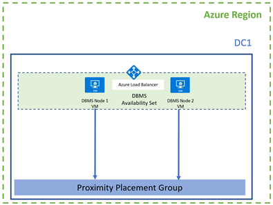

to an Availability zone:

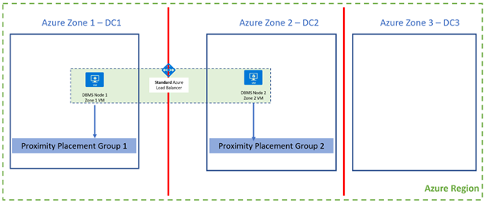

### Migration using the PowerShell Script  
  
When you decide to move the DBMS VM to the zone using PowerShell scripts before you execute the migration script:  

  - DB node 1 is primary active DB node, and node 2 is secondary inactive DB node.

  - You can start the procedure on secondary node 2 DBMS VM.

  - When you have a cluster (Windows Failover Cluster or Linux Pacemaker) make sure to drain the cluster node. This means that you need to move clustered resources to another node.

  - When you use **Oracle Data Guard**, make sure that Oracle **protection mode** is **Max Availability** – this will ensure that primary Oracle VM will be up and running while secondary Oracle VM is down.
    In this way, the SAP system will be up and running.

  - Run PowerShell command to migrate node 2 VM to zone 2:

    ```powershell
    Move-AzVMToAzureZoneAndOrProximityPlacementGroup -VMResourceGroupName GOR-M-SERIES -VirtualMachineName dbms-node-2 -AzureZone 2 -PPGResourceGroupName gor-ppg-group -ProximityPlacementGroupName PPGZone2 -AzureInternalLoadBalancerResourceGroupName gor-lb-group -AzureInternalLoadBalancerName dbms-ilb
    ```

  - If you use DBMS that doesn't require Azure ILB, like Oracle Data Guard, then you do NOT specify AzureInternalLoadBalancerName and AzureInternalLoadBalancerResourceGroupName parameters:

    ```powershell
    Move-AzVMToAzureZoneAndOrProximityPlacementGroup -VMResourceGroupName GOR-M-SERIES -VirtualMachineName dbms-node-2 -AzureZone 2 -PPGResourceGroupName gor-ppg-group -ProximityPlacementGroupName PPGZone2
    ```

  - When node 2 DBMS VM is migrated in zone 2, star it.

  - Make sure that DBMS node 2 joined the cluster.

  - Wait that DBMS is synchronized to the secondary node 2 DB node.

  - Fail over DB from primary node 1 to secondary node 2 VM

  - Now node 2 is primary and node 1 is secondary.

  - Drain primary cluster node 1 from all other resources.

  - Run PowerShell command to migrate node 1 VM to Zone 1

      ```powershell
      Move-AzVMToAzureZoneAndOrProximityPlacementGroup -VMResourceGroupName GOR-M-SERIES -VirtualMachineName dbms-node-1 -AzureZone 1 -PPGResourceGroupName gor-ppg-group -ProximityPlacementGroupName PPGZone1 -AzureInternalLoadBalancerResourceGroupName gor-lb-group -AzureInternalLoadBalancerName dbms-ilb
      ```

  - If you use DBMS that doesn't require Azure ILB, like Oracle Data Guard, then you do NOT specify AzureInternalLoadBalancerName and AzureInternalLoadBalancerResourceGroupName parameters:

    ```powershell
    Move-AzVMToAzureZoneAndOrProximityPlacementGroup -VMResourceGroupName GOR-M-SERIES -VirtualMachineName dbms-node-1 -AzureZone 1 -PPGResourceGroupName gor-ppg-group -ProximityPlacementGroupName PPGZone1
    ```

  - When primary VM is migrated to the Zone 1, start the node 1 VM.

  - Make sure that DBMS node 2 joined the cluster.

  - Check the DBMS is synchronized again

### Migration using the DB Replication.  
  
One way to migrate your DBMS nodes is to use the DB replication method.  
  
High level procedure is following:

  - First you need to deploy two new zonal DB VMs (in zones 1 and 2) and install DBMS software.

  - Configure to replicate DB from old primary to the new secondary DB VM in zone 2.

  - When replication is finished, failover to the new DB VM in zone 2.

  - The new DB VM in zone 2 is now primary DB node.

  - Configure replication from new DB node in zone 2 to the new DB node in zone 1 (now secondary)

Exact detail how to configure DBMS to replicate is DB specific and it will not be discussed in detail in this document.

### Migration from Mv1 Gen1 to Zonal Mv1 Gen2 or Mv2 Gen2

In Azure VM type can be of Generation 1 or [Generation 2](https://docs.microsoft.com/en-us/azure/virtual-machines/generation-2) type.

Mv1 VM type can be of Gen1 and Gen2 type. Mv2 is only Gen2 type.

**It is not possible to resize VMs of Gen 1 type to Gen 2 type.** In this case, you need to use DBMS migration method,  e.g., **Migration using the DB Replication**, in the following way:

  - First you need to deploy two new zonal DB VM Mv1 Gen 2 or Mv2 Gen2 (in zone 1 and 2) and install DBMS software.

  - Configure to replicate DB from old primary Gen 1 to the new secondary Gen 2 DB VM in zone 2.

  - When replication is finished, failover DB to the new Gen 2 DB VM in zone 2.

  - New Gen2 DB VM in zone 2 is now primary DB node.

  - Configure replication from new Gen2 DB node in zone 2 to the new Gen 2 DB node in zone 1 (now secondary)

Exact detail how to configure DBMS to replicate is DB specific and it will not be discussed here in detail.

### Migration of HANA DB from HANA Large Instances (HLI) to Zonal VMs

HANA Large Instances are bare metal Azure offering. As it isn't possible to convert a bare metal OS into a VM, the only way to migrate HANA DB is to use HANA DB replication to migrate to zonal VM. This method is described in the official guidelines: [SAP HANA on Azure Large
Instance migration to Azure Virtual Machines](https://docs.microsoft.com/en-us/azure/virtual-machines/workloads/sap/hana-large-instance-virtual-machine-migration).

## File Share Migration or Replacement

### Linux based NFS File Share

#### Migration Option 1.1 – Move Linux based NFS Cluster HA File Share

You might have Linux based HA NFS file share implemented as Linux OS service:

  - [Two nodes cluster on SLES with Pacemaker and DRBD](https://docs.microsoft.com/en-us/azure/virtual-machines/workloads/sap/high-availability-guide-suse)

  - [Two nodes cluster on RHEL with GlusterFS](https://docs.microsoft.com/en-us/azure/virtual-machines/workloads/sap/high-availability-guide-rhel)

And you're migrating from an Availability Set:

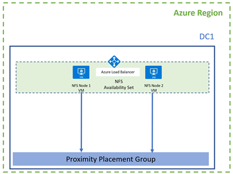

to an Availability Zone:

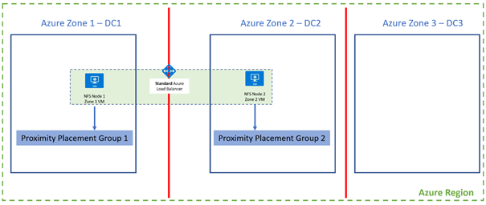


If you would like to keep these two VM HA file share clusters, you can move them to the zones like this:

  - Drain the node 2, e.g., fail over all file shares to the node 1

  - Execute this PowerShell command to move **node 2** to **zone 2** and **PPGZone2**  
      
    ```powershell
    Move-AzVMToAzureZoneAndOrProximityPlacementGroup -VMResourceGroupName SAPResourceGroup -VirtualMachineName fs-node-2 -AzureZone 2 -PPGResourceGroupName ppg-group -ProximityPlacementGroupName PPGZone2 -AzureInternalLoadBalancerResourceGroupName lb-group  -AzureInternalLoadBalancerName FileShareILB
    ```
    
  - When node 2 VM is migrated to zone 2, start the VM

  - Make sure that node 2 joined the cluster

  - Fail over file share to the node 2 and drain node 1

  - Execute this PowerShell command to move **node 1** to **zone 1** and **PPGZone1**  
      
    ```powershell
    Move-AzVMToAzureZoneAndOrProximityPlacementGroup -VMResourceGroupName SAPResourceGroup -VirtualMachineName fs-node-1 -AzureZone 1 -PPGResourceGroupName ppg-group -ProximityPlacementGroupName PPGZone1 -AzureInternalLoadBalancerResourceGroupName lb-group     -AzureInternalLoadBalancerName FileShareILB
    ```

  - When node 1 VM is migrated to Zone 1, start the VM

  - Make sure that node 1 joined the cluster

#### Migration Option 1.2 – Deploy new Linux based NFS Cluster HA File Share

Alternative approach with Linux based HA file share implemented as Linux OS service is to:

  - Deploy a new FS cluster with two VMs.

  - Node 1 is in zone 1 and PPGZone1.

  - Node 2 is in zone 2 and PPGZone2.

  - Install and configure File Share cluster

  - Copy SAP files

  - Reconfigure operating system to connect to the new file share.

#### Migration Option 1.3 - Move File Share HA Cluster to Azure File Share for NFS

To simplify the overall management of the file share cluster, **it is recommended** to use file share cloud service as [Azure Files NFS v4.1](https://techcommunity.microsoft.com/t5/running-sap-applications-on-the/deploy-sap-ascs-ers-with-azure-files-nfs-v4-1-shares/ba-p/2038320)


And you're migrating from an HA cluster file share solution in Availability Set:


to a zonal Azure File Share for NFS cloud SaaS service:

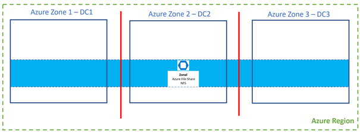

A great advantage of cloud SaaS service:

  - Easy deployment of NFS PaaS cloud service

  - NO MANAGEMNT of NFS PaaS cloud service

Migration procedure is requiring manual steps:

  - Deploy new Azure Files NFS v4.1 cloud service.

  - Copy the SAP file from old file share to the new Azure Files NFS v4.1 cloud service.

  - Remount NFS mount points on cluster nodes to the new file share

### Windows based SMB File Share with SIOS as Shared Disk

On Windows cluster, you could use [SIOS as a software based shared disk](https://docs.microsoft.com/en-us/azure/virtual-machines/workloads/sap/sap-high-availability-guide-wsfc-shared-disk#shared-disks-in-azure-with-sios-datakeeper).  
  
In shared disk approach, [both SAP ASCS/SCS instance and SAPMNT file shared are installed on a shred disk](https://docs.microsoft.com/en-us/azure/virtual-machines/workloads/sap/sap-high-availability-guide-wsfc-shared-disk#sap-ascsscs-ha-with-cluster-shared-disks),
therefore it isn't necessary to have separate HA file share.

By migrating SAP ASCS/SCS instance using SIOS as a shared disk, which is described below, you also move SAPMNT file share.

### Windows based SMB File Share with Azure Shared Disk

In Windows cluster for SAP ASCS/SCS shared disk approach, [both SAP ASCS/SCS instance and SAPMNT file shared are installed on a shred disk](https://docs.microsoft.com/en-us/azure/virtual-machines/workloads/sap/sap-high-availability-guide-wsfc-shared-disk#sap-ascsscs-ha-with-cluster-shared-disks), therefore it isn't necessary to have separate HA file share.

SAP on Azure cmdlets doesn't support migration of Windows SAP ASCS/SCS cluster with regional Azure shared disks to zones.  
  
The only way to migrate local redundant Azure shared disk to the zones, is the new SAP ASCS/SCS cluster installation with zonal redundant Azure shared disks, and manually configuration of SAP system to use new SAP ASCS/SCS cluster. 

### Windows based SMB File Share with SOFS cluster or Azure NetApp for SMB

In Windows cluster for SAP ASCS/SCS file share approach, *sapmnt* file share is located outside of the SAP ASCS/SCS cluster.

If you have SAP ASCS/SCS cluster, which is configured as a File Share, you could use one of the following file share solutions:

  - [Windows Scale Out File Share Cluster solution with Storage Spaces Direct](https://docs.microsoft.com/en-us/azure/virtual-machines/workloads/sap/sap-high-availability-guide-wsfc-file-share#scale-out-file-shares-with-storage-spaces-direct-in-azure-as-an-sapmnt-file-share).

  - [Azure NetApp Files (SMB)](https://docs.microsoft.com/en-us/azure/virtual-machines/workloads/sap/high-availability-guide-windows-netapp-files-smb)

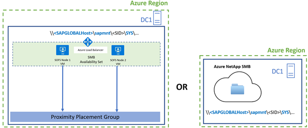

Both solutions aren't supported in the zones.

Supported zonal SMB file share solution is [Azure Files for SMB](https://docs.microsoft.com/en-us/azure/virtual-machines/workloads/sap/high-availability-guide-windows-azure-files-smb).

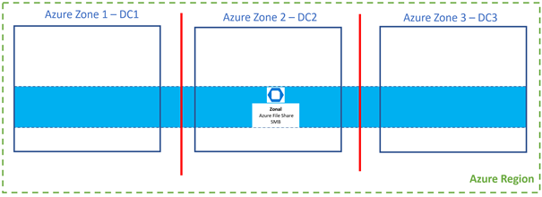

 **NOTE:** [Azure Files for SMB](https://docs.microsoft.com/en-us/azure/virtual-machines/workloads/sap/high-availability-guide-windows-azure-files-smb) is Azure cloud SaaS service, therefore is also recommended.

You need to manually migrate SAP file share to zonal Azure Files for SMB, which would include manual steps to:

  - create new zonal Azure Files for SMB

  - copy the SAP global host files

  - Set file share security

  - Reconfigure Windows ASCS/SCS cluster to use new file share

## SAP Central Services Migration 

Your SAP Central Services cluster layer will be moved from Availability Set:  
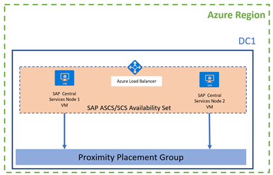

to an Availability Zone:

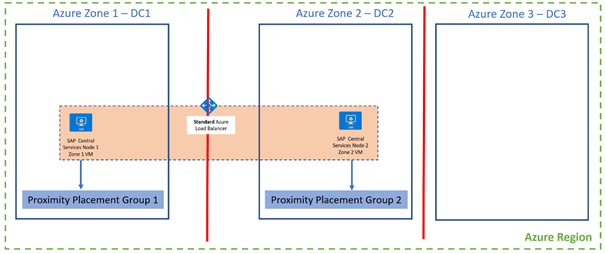

SAP license key is bound to the host where SAP ASCS/SCS is running. When SAP ASCS/SCS is clustered, you'll have two licenses installed.  In Azure, SAP is using Unique VM ID to calculate the license key. As the VM is newly re-created it will get NEW unique VM ID, so the old license for the recreated VM will be invalid. **For the each recreated SAP ASCS/SCS node, you need to get new hardware key,  generate new license and install it.**.  

> [!NOTE]
> For more details on SAP licensing in Azure check this blog [SAP NetWeaver Licensing Mechanism in Microsoft Azure Cloud - Part 1.](https://techcommunity.microsoft.com/t5/running-sap-applications-on-the/sap-netweaver-licensing-mechanism-in-microsoft-azure-cloud-part/ba-p/465096)
>

### Linux based SAP ASCS/SCS Clusters

On Linux, you would typically use clustering solution like **Linux Pacemaker** on SLES and RedHat with two nodes for SAP central services. SAP ASCS/SCS files are stored on some HA NFS file share.

Procedure is following:

  - On node 1 is running clustered SAP ASCS/SCS

  - On node 2 is running clustered ERS instance

  - Fail over ERS to node 1, and drain secondary cluster node.

  - Run PowerShell command to migrate node 2 VM to the zone 2
    
    ```powershell
    Move-AzVMToAzureZoneAndOrProximityPlacementGroup -VMResourceGroupName RRG-SAP -VirtualMachineName ascs-node-2 -AzureZone 2 -PPGResourceGroupName ppg-group -ProximityPlacementGroupName PPGZone2 -AzureInternalLoadBalancerResourceGroupName lb-group -AzureInternalLoadBalancerName  scs-ilb
    ```

  - When node 2 VM is migrated to zone 2, start the VM.

  - Make sure that node 2 VM joins the Pacemaker cluster.

  - **Install new SAP license key with hardware key from the migrated node 2.**  

    
  - Fail over SAP ERS instance to the node 2 (now in zone 2)

  - Fail over SAP ASCS/SCS instance to the node 2 (now in zone 2).

    As ERS is already on secondary node, enqueue lock table will be replicated and saved.

  - Drain complete node 1 of all clustered resources.


  - Run PowerShell command to migrate node 1 VM to the Zone 1

    ```powershell
    Move-AzVMToAzureZoneAndOrProximityPlacementGroup -VMResourceGroupName RRG-SAP -VirtualMachineName ascs-node-1 -AzureZone 1 -PPGResourceGroupName ppg-group -ProximityPlacementGroupName PPGZone1 -AzureInternalLoadBalancerResourceGroupName lb-group -AzureInternalLoadBalancerName ascs-ilb
    ```

  - When node 1 VM is migrated to zone 1, start the VM.

  - Make sure that node 1 VM joins the Pacemaker cluster.

  - **Install new SAP license key with hardware key from the migrated node 1.**  
   
  - Fail over ERS instance to node 1

### Windows Based SAP ASCS/SCS Cluster with SIOS as a Shared Disk Solution

Procedure is following:

  - On node 1 is running SAP ASCS/SCS

  - If you have [SAP ERS2](https://blogs.sap.com/2019/03/19/new-enqueue-replicator-in-failover-cluster-environments/)
    instance, it's running on node 2. (ERS2 is also clustered instance).

  - If you have [SAP ERS1](https://help.sap.com/viewer/3741bfe0345f4892ae190ee7cfc53d4c/CURRENT_VERSION_SWPM20/en-US/8abd4b52902d4b17a105c2fabdf5c0cf.html),
    ERS1 is always installed on local cluster node, and it not relevant to handle it.

  - Failover ERS2 to Node 1, e.g., drain cluster node 2.

  - Run PowerShell command to migrate node 2 VM to the Zone 2:  

    ```powershell
    Move-AzVMToAzureZoneAndOrProximityPlacementGroup -VMResourceGroupName RRG-SAP -VirtualMachineName ascs-node-2 -AzureZone 2 -PPGResourceGroupName ppg-group -ProximityPlacementGroupName PPGZone2 -AzureInternalLoadBalancerResourceGroupName lb-group -AzureInternalLoadBalancerName  scs-ilb
    ```

  - When node 2 VM is migrated to zone 2, start the VM.

  - Make sure that node 2 VM joins the Windows cluster.

  - **Install new SAP license key with hardware key from the migrated node 2.**  
    
  - Fail over SAP ERS2 instance to the node 2 (now in zone 2)

  - Fail over SAP ASCS/SCS instance to the node 2 (now in zone 2)  

    As ERS2 is already on secondary node, enqueue lock table will be replicated and saved.

  - Drain complete node 1 of all clustered resources.    
    
  - Run PowerShell command to migrate node 1 VM to the zone 1:  

    ```powershell
    Move-AzVMToAzureZoneAndOrProximityPlacementGroup -VMResourceGroupName RRG-SAP -VirtualMachineName ascs-node-1 -AzureZone 1 -PPGResourceGroupName ppg-group -ProximityPlacementGroupName PPGZone1 -AzureInternalLoadBalancerResourceGroupName lb-group -AzureInternalLoadBalancerName ascs-ilb
    ```

  - When node 1 VM is migrated to zone 1, start the VM.


  - Make sure that node 1 VM joins the Windows cluster.

  - **Install new SAP license key with hardware key from the migrated node 1.**  

  - Failover ERS2 instance to node 1

### Windows Based SAP ASCS/SCS Cluster with Azure Shared Disk Solution

Script doesn’t support Azure shared disk. You need to deploy a new cluster with zonal Azure Shared disk, which is a manual procedure here.

### Windows Based SAP ASCS/SCS Cluster with File Share 

If you have SAP ASCS/SCS cluster, which is configured as a File Share, you could use one of the following file share solutions:

  - [Windows Scale Out File Share Cluster solution with Storage Spaces Direct](https://docs.microsoft.com/en-us/azure/virtual-machines/workloads/sap/sap-high-availability-guide-wsfc-file-share#scale-out-file-shares-with-storage-spaces-direct-in-azure-as-an-sapmnt-file-share).

  - [Azure NetApp Files (SMB)](https://docs.microsoft.com/en-us/azure/virtual-machines/workloads/sap/high-availability-guide-windows-netapp-files-smb)

Both solutions are NOT supported in the zones.

Therefore, you need to first migrate SAP file share manually to zonal Azure Files for SMB

Procedure to move SAP ASCS/SCS cluster VM nodes is following:

  - On node 1 is running SAP ASCS/SCS

  - If you have [SAP  ERS2](https://blogs.sap.com/2019/03/19/new-enqueue-replicator-in-failover-cluster-environments/) instance, it's running on node 2. (ERS2 is also clustered
    instance).

  - If you have [SAP ERS1](https://help.sap.com/viewer/3741bfe0345f4892ae190ee7cfc53d4c/CURRENT_VERSION_SWPM20/en-US/8abd4b52902d4b17a105c2fabdf5c0cf.html), ERS1 is always installed on local cluster node, and it not relevant to handle it.

  - Failover ERS2 to Node 1, e.g., drain cluster node 2.

    Run PowerShell command to migrate node 2 VM to the Zone 2:  

    ```powershell
    Move-AzVMToAzureZoneAndOrProximityPlacementGroup -VMResourceGroupName RRG-SAP -VirtualMachineName ascs-node-2 -AzureZone 2 -PPGResourceGroupName ppg-group -ProximityPlacementGroupName PPGZone2 -AzureInternalLoadBalancerResourceGroupName lb-group -AzureInternalLoadBalancerName   scs-ilb
    ```

  - When node 2 VM is migrated to zone 2, start the VM.

  - Make sure that node 2 VM joins the Windows cluster.

  - **Install new SAP license key with hardware key from the migrated node 2.**  
    
  - Fail over SAP ERS2 instance to the node 2 (now in zone 2)

  - Fail over SAP ASCS/SCS instance to the node 2 (now in zone 2)  

    As ERS2 is already on secondary node, enqueue lock table will be replicated and saved.

  - Drain complete node 1 of all clustered resources.
    
    Run PowerShell command to migrate node 1 VM to the zone 1:  

    ```powershell
    Move-AzVMToAzureZoneAndOrProximityPlacementGroup -VMResourceGroupName RRG-SAP -VirtualMachineName ascs-node-1 -AzureZone 1 -PPGResourceGroupName ppg-group -ProximityPlacementGroupName PPGZone1 -AzureInternalLoadBalancerResourceGroupName lb-group -AzureInternalLoadBalancerName ascs-ilb
    ```

  - When node 1 VM is migrated to zone 1, start the VM.

  - Make sure that node 1 VM joins the Windows cluster.

  - **Install new SAP license key with hardware key from the migrated node 1.**  

  - Failover ERS2 instance to node 1

## SAP Application Servers Migration 

Your SAP applicant servers’ layer will be moved from source Availability Set:

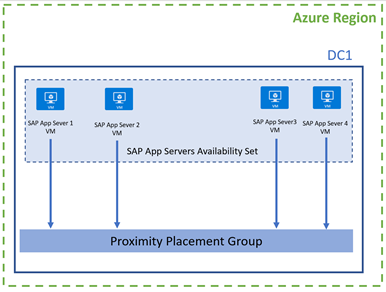

to new Availability Set that is associated with Proximity Placement Group (PPG), and through PPG and anchor VMs (either SAP ASCS/SCS or DBMS VMs) indirectly to an Azure availability zone:

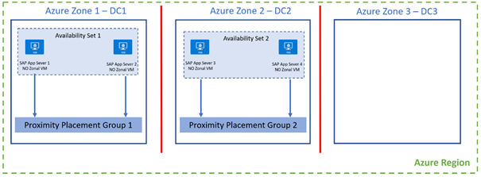

### Option 1: Migrate SAP Application Server VM using PowerShell Command.

 **NOTE:**
  When you use PowerShell cmdlet `Move-AzVMToAvailabilitySetAndOrProximityPlacementGroup` only VM will be handled. You need to manage SAP application server manual by yourself – e.g. stop it before executing VM migration, and start it after the VM is migrated. 

You need to migrate SAP application server VM to:

  - New Availability Set

  - Proximity Placement Group

A set of SAP application servers will be moved to an **Availability Set 1** and **PPGZone1** (e.g., indirectly to zone 1 using the PPGZone1), and another set will be moved to an **Availability Set 2** and **PPGZone2** (e.g., indirectly to zone 2 using the PPGZone2).

The procedure to migrate SAP Application Server VM is the following:

  - Execute SAP soft shutdown of SAP app server.

  - Execute this PowerShell command to move SAP application servers VM to new availability Set and PPG to move to **Availability Set** 1 and **PPGZone1** in the **zone 1**:  

    ```powershell
    Move-AzVMToAvailabilitySetAndOrProximityPlacementGroup -ResourceGroupName "SAPResourceGroup" -VirtualMachineName "sap-app-server1-vm" -AvailabilitySetName Av-Set-Zone1 -ProximityPlacementGroupName PPGZone1 
    ```

  - Execute this PowerShell command to move SAP application servers VM to new availability Set and PPG to move to **Availability Set 2** and **PPGZone2** in **zone 2**:  
      
    ```powershell
    Move-AzVMToAvailabilitySetAndOrProximityPlacementGroup -ResourceGroupName "SAPResourceGroup" -VirtualMachineName "sap-app-server2-vm" -AvailabilitySetName Av-Set-Zone2 -ProximityPlacementGroupName PPGZone2
    ```

  - When VM is migrated to new Availability Set and PPG, start the VM.

  - Start the SAP application server.

### Option 2: End-to-end Migration of the SAP Application Servers VMs using PowerShell Command 

  **NOTE:**
  When you use PowerShell cmdlet `Move-AzSAPApplicationServerVMToAzureAvaialbilitySetAndOrProximityPlacementGroup`, both SAP application server (stopping and staring) and VM migration will be handled.

You need to migrate SAP application server VM to:

  - New Availability Set

  - Proximity Placement Group

A set of SAP application servers will be moved to an **Availability Set 1** and **PPGZone1** (e.g., indirectly to zone 1 using the PPGZone1), and another set will be moved to an **Availability Set 2** and **PPGZone2** (e.g., indirectly to zone 2 using the PPGZone2).

The procedure to migrate SAP Application Server VM is following:

  - Execute this PowerShell command to move SAP application servers VM to new availability Set and PPG to move to **Availability Set** 1 and **PPGZone1** in the **zone 1**:  
      
    On **Linux OS** you'll call the cmdlet like this:

    ```powershell
    Move-AzSAPApplicationServerVMToAzureAvaialbilitySetAndOrProximityPlacementGroup -SAPSID TS1 -SAPInstanceNumber 1 -VMResourceGroupName RG-TS1-APPServer -VirtualMachineName ts2-di0 -SoftShutdownTimeInSeconds 300 -AvailabilitySetName Av-Set-Zone1 -PPGResourceGroupName RG-PPG-TS1 -ProximityPlacementGroupName PPGZone1
    ```

    On **Windows OS** you'll call the cmdlet like this:

    ```powershell
    # Get the \<sid\>adm password in secure way
    $SAPSIDADMUserCred = Get-Credential -UserName $SIDADM -Message 'Enter  Password:'

    Move-AzSAPApplicationServerVMToAzureAvaialbilitySetAndOrProximityPlacementGroup -SAPSID PR2 -SAPInstanceNumber 0 -VMResourceGroupName RG-PR2-APPServer -VirtualMachineName pr2-di0 -SoftShutdownTimeInSeconds 600 -SAPsidadmUserPassword $SAPSIDADMUserCred -PathToSAPControl  "C:\\usr\\sap\\PR2\\D00\\exe\\sapcontrol.exe" -AvailabilitySetName Av-Set-Zone1 -PPGResourceGroupName RG-PPG-PR2 -ProximityPlacementGroupName PPGZone1
    ```

  - Execute this PowerShell command to move SAP application servers VM to new availability Set and PPG to move to **Availability Set 2** and **PPGZone2** in **zone 2**:  
      
    On **Linux OS** you'll call the cmdlet like this:

    ```powershell
    Move-AzSAPApplicationServerVMToAzureAvaialbilitySetAndOrProximityPlacementGroup -SAPSID TS1 -SAPInstanceNumber 1 -VMResourceGroupName RG-TS1-APPServer -VirtualMachineName ts2-di1 -SoftShutdownTimeInSeconds 300 -AvailabilitySetName Av-Set-Zone2 -PPGResourceGroupName RG-PPG-TS1 -ProximityPlacementGroupName PPGZone2
    ```

    On **Windows OS** you'll call the cmdlet like this:

    ```powershell
    # Get the \<sid\>adm password in secure way
    $SAPSIDADMUserCred = Get-Credential -UserName $SIDADM -Message 'Enter  Password:'

    Move-AzSAPApplicationServerVMToAzureAvaialbilitySetAndOrProximityPlacementGroup  -SAPSID PR2 -SAPInstanceNumber 1 -VMResourceGroupName RG-PR2-APPServer -VirtualMachineName pr2-di1 -SoftShutdownTimeInSeconds 600 -SAPsidadmUserPassword $SAPSIDADMUserCred -PathToSAPControl  "C:\\usr\\sap\\PR2\\D01\\exe\\sapcontrol.exe" -AvailabilitySetName Av-Set-Zone2 -PPGResourceGroupName RG-PPG-PR2 -ProximityPlacementGroupName PPGZone2 
    ```


### Option 3: Migrate SAP Application Servers by installing new SAP application Servers.

SAP Application servers are redundant components.  
  
Another approach to migrate SAP app servers to Zones is to:

  - Install **new VMs** in the **Availability Set 1** and **PPGZone1** (e.g., indirectly to zone 1)

  - Install **new VMs** in the **Availability Set 2** and **PPGZone2** (e.g., indirectly to zone 2)

  - On each VM **install** **new** SAP application servers

  - add the SAP application server to proper SAP logon groups.

  - delete old SAP application servers and delete old VMs.

## Windows Cloud Witness Consideration 

On Windows failover cluster you need cluster quorum mechanism. In Azure it's recommended to use [cloud witness PaaS service](https://docs.microsoft.com/en-us/windows-server/failover-clustering/deploy-cloud-witness). In the zonal context, it's important that you choose for an Azure storage account ZRS (Zonal Redundant Storage) storage type.

## Linux Pacemaker STONITH / Fencing Consideration 

In Linux Pacemaker cluster fencing is important concept HA concept, which can be implemented using different STONITH options. 

### Linux Pacemaker with Red Hat Linux on Azure 

With RedHat, [STONITH](https://docs.microsoft.com/en-us/azure/virtual-machines/workloads/sap/high-availability-guide-rhel-pacemaker#create-stonith-device)TH is implemented using Azure API to execute the fencing. Azure API approach is fully transparent for zonal HA.

### Linux Pacemaker with SLES Linux on Azure 

With SLES there are two options to implement fencing:

  - [Using SBD devices deployed on three VMs](https://docs.microsoft.com/en-us/azure/virtual-machines/workloads/sap/high-availability-guide-suse-pacemaker#default-pacemaker-configuration-for-sbd)

  - [SBD with an Azure shared disk](https://docs.microsoft.com/en-us/azure/virtual-machines/workloads/sap/high-availability-guide-suse-pacemaker#sbd-with-an-azure-shared-disk)  
    If zonal Azure shared disks is available in your region, this is recommended option to replace three VMs used as iSCSI servers for SBD.

  - [Azure fence agent](https://docs.microsoft.com/en-us/azure/virtual-machines/workloads/sap/high-availability-guide-suse-pacemaker#use-an-azure-fence-agent-1)  
    If zonal Azure shared disks is NOT available in your region, this is recommended option to replace three VMs used as iSCSI servers for SBD.

#### Migrating SBD Devices to Zones

If you use SDB devices as the Pacemaker fencing mechanism, which is deployed on three VMs, then these three VMs needs to be placed in all three Availability Zones:

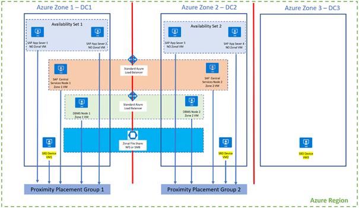

Detail design and migration are following:

  - SBD Device **VM1** is deployed in **zone 1** and **Proximity Placement Group 1**  
      
    You can use PowerShell command to migrate VM1 to Zone 1 like this:  

    ```powershell
    Move-AzVMToAzureZoneAndOrProximityPlacementGroup -VMResourceGroupName SAPResourceGroup -VirtualMachineName sbd-vm1 -AzureZone 1 -PPGResourceGroupName ppg-group -ProximityPlacementGroupName PPGZone1 
    ```

  - SBD Device **VM2** is deployed in **zone 2** and **Proximity Placement Group 2**  
      
    You can use PowerShell command to migrate VM2 to zone 2 like this:  
      
    ```powershell
    Move-AzVMToAzureZoneAndOrProximityPlacementGroup -VMResourceGroupName SAPResourceGroup -VirtualMachineName sbd-vm2 -AzureZone 2 -PPGResourceGroupName ppg-group -ProximityPlacementGroupName PPGZone2
    ```

  - SBD Device **VM3** is deployed in **zone 3**  
      
    You can use PowerShell command to migrate VM3 to zone 3 like this:  
    ```powershell
    Move-AzVMToAzureZoneAndOrProximityPlacementGroup -VMResourceGroupName SAPResourceGroup -VirtualMachineName sbd-vm3 -AzureZone 3
    ```
    
    Alternative approach to move three existing iSCSI SBD VMs to zones, is to deploy three new iSCSI SBD VMs and reconfigure SBD devices as describe in the blog [How to switch SBD Devices (iSCSI Target VMs) for SLES Pacemaker Cluster in Azure](https://techcommunity.microsoft.com/t5/running-sap-applications-on-the/how-to-switch-sbd-devices-iscsi-target-vms-for-sles-pacemaker/ba-p/2713205).

## Recovery of Original VM in the Case of PowerShell cmdlets Failure

During the VM migration to the either zone or to the availability set, original VM is deleted, and new VM is created. 
If recreating VM fails during the migration to zones or to new availability set, you can always restore original VM using the original a disk.

**IMPORTANT:** PowerShell cmdlets could fail when some constraints are not met. A typical example is when you are using PPG. PPG is forcing a VM SKU to land not just in the same zone, but land in the same data center, as the anchor VM. It could happen that VM SKU is available in the same zone as the anchor VM, but not available in the same data center as the anchor VM. In this scenario VM recreation will fail. 
Although cmdlets are doing many prechecks to make sure that all constraints are met, not everything can be checked programmatically, and VM recreation could fail.  

### Recovery of failed VM when moving to Availability Set 

You can use Azure portal to restore original VM, which is described in the document [How to restore Azure VM data in Azure portal](https://docs.microsoft.com/en-us/azure/backup/backup-azure-arm-restore-vms).

Original OS and data disk names are unchanged during migration to an Availability Set.

### Recovery of failed VM when moving to Availability Zone 

You can use Azure portal to restore original VM, which is described in the document [How to restore Azure VM data in Azure portal](https://docs.microsoft.com/en-us/azure/backup/backup-azure-arm-restore-vms).

If you did NOT specified flag `-KeepSameDiskNames`, original OS and data disk names are unchanged during migration to zone.

In case you did specify flag `-KeepSameDiskNames`, original OS and data disk names are changed/copied during migration to zone to a new disk `<OriginalDiskName>-orig<FreeNumber>`. These new disk names of the original disks are printed in the PowerShell console.