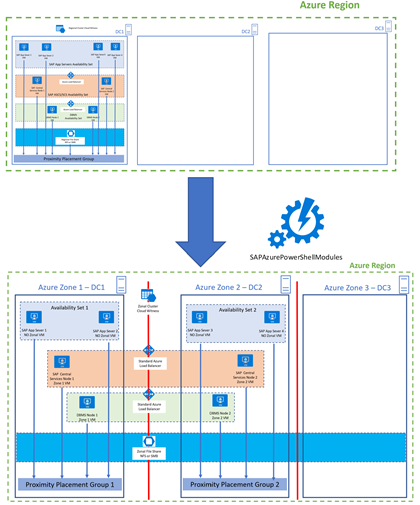

# PowerShell cmdlets to Migrate a Highly Available SAP System in Azure from Availability Set to Availability Zone

A set of **SAP on Azure PowerShell cmdlets** is helping to:

  - Migrate an existing SAP highly available system from **Azure Availability Set** to **Azure Zone**.

  - Automate the whole procedure on Windows and Linux based SAP systems.

  - **Reducing migration time** from **months** to **minutes/hours**.

  - There's no need for any post configuration activities.

  - The whole procedure is also offering a way to **avoid full SAP system downtime** if desired (rolling approach) and it's minimizing or removing impact on productive SAP systems business processes.  
    During migration process, **SAP systems can stay online all time or most of the time**.




**IMPORTANT**
Before you execute the migration and scripts on the productive SAP system, make sure to test it on the test VMs. Ideally, a HA SAP system is also installed on the test VMs. Make sure that test VMs have the same configuration as productive VMs. That means they should
have the same VM SKU, disk types, disk numbers and sizes, same number of NIC cards, same subscription, load balancers etc. If possible, place test VMs inside of the same subnet as productive VMs and in the same resource groups.


Here's high level procedure:

  - Prerequisite checks – check if specific region supports zones, identify two zones that are close for good network latency, check if VM types are available in the needed zones etc.

  - Check if existing **Load Balancers** (**LB**) are **Standard** type that supports zones. If there are **Basic** load balancers, convert them to Standard type.

  - Create two **Proximity Placement Groups** (**PPG1** and **PPG2**) for each zone

  - Create two new **Azure Availability Sets** for each zone, for SAP application servers, and configure availability sets to use corresponding PPGs.

  - Prepare PowerShell environment and scripts.

  - Move DBMS cluster VM1 to zone 1 (and optional PPG1) using PowerShell cmdlet `Move-AzVMToAzureZoneAndOrProximityPlacementGroup`

  - Move DBMS cluster VM2 to zone 2 (and optional PPG2) using PowerShell cmdlet `Move-AzVMToAzureZoneAndOrProximityPlacementGroup`

  - If you have file share cluster (like SUSE Linux with Pacemaker + DRBD, Red Hat GlusterFS):
    
      - Move file share cluster VM1 to zone 1 and PPG1 using PowerShell cmdlet `Move-AzVMToAzureZoneAndOrProximityPlacementGroup`
    
      - Move file share cluster to zone 2 and PPG2 using PowerShell cmdlet `Move-AzVMToAzureZoneAndOrProximityPlacementGroup`

  - Move SAP ASCS/SCS cluster VM1 to zone 1 and PPG1 using PowerShell cmdlet `Move-AzVMToAzureZoneAndOrProximityPlacementGroup`

  - Install new SAP license key using the hardware key from SAP ASCS/SCS cluster VM1

  - Move SAP ASCS/SCS VM2 to zone 2 and PPG2 using PowerShell cmdlet `Move-AzVMToAzureZoneAndOrProximityPlacementGroup`

  - Install new SAP license key using the hardware key from SAP ASCS/SCS cluster VM2

  - Move set of SAP application servers VMs to Availability Set 1 (associated with PPG1) using PowerShell cmdlet  `Move-AzVMToAvailabilitySetAndOrProximityPlacementGroup` 

  - Move another set of SAP application servers VMs to Availability Set 2 (associated with PPG2) using PowerShell cmdlet `Move-AzVMToAvailabilitySetAndOrProximityPlacementGroup`


## Prepare PowerShell Environment and Scripts

### Use PowerShell Environment 7.2 or newer

To migrate SAP layers to zones, you can use PowerShell scripts, which you need to download first. You need a PowerShell runtime environment of at least 7.2 or newer.

You can check PowerShell version by running this command:  
  
```powershell
$PSVersionTable.PSVersion
```

| Major | Minor | Patch | PreReleaseLabel  | BuildLabel |
| --- | --- | --- |---| ---| 
| 7 | 2 | 1 | | |

### Install Latest `Az` PowerShell Modules

Install the latest version of **Az** PowerShell modules. This is described in the official guide [Install the Azure Az PowerShell module](https://docs.microsoft.com/en-us/powershell/azure/install-az-ps?view=azps-7.1.0).

### Install Latest `SAPAZurePowerShellModules` Modules

All PowerShell modules are part of the module called **SAPAZurePowerShellModules**. This PowerShell module is available in the PowerShell Gallery.

You can find this PowerShell module by running this PowerShell command:  

```powershell
Find-Module SAPAZurePowerShellModules
```

| Version | Name | Repository  | Description |
| --- | --- | --- |---| 
| 0.1.20 | SAPAzurePowerShellModules | PSGallery |SAP on Azure PowerShell Modules used for automation. |


You can install this module by running this PowerShell command:

```powershell
Install-Module SAPAZurePowerShellModules -Verbose
```

When asked *Are you sure to install the modules from ‘PSGallery’?*, answer with: **Y**.

To load the PowerShell module, run this PowerShell command:

```powershell
Import-Module SAPAZurePowerShellModules -Verbose
```

## Move-AzVMToAzureZoneAndOrProximityPlacementGroup

PowerShell cmdlet `Move-AzVMToAzureZoneAndOrProximityPlacementGroup` will move the VM to the Availability Zone and PPG.

You'll use this command to move:

  - **DBMS** layer to the zones

  - **SAP Centrale services** layer to the zones

  - **HA File Share cluster** - If you're using it for SAPMNT and SAPTRANS file shares, SAP ASCS/SCS files


You'll call the cmdlet like this:

```powershell
Move-AzVMToAzureZoneAndOrProximityPlacementGroup -VMResourceGroupName GOR-M-SERIES -VirtualMachineName dbms-node-2 -AzureZone 2 -PPGResourceGroupName gor-ppg-group -ProximityPlacementGroupName PPGZone2 -AzureInternalLoadBalancerResourceGroupName gor-lb-group -AzureInternalLoadBalancerName dbms-ilb
```

> [!NOTE]
> PowerShell cmdlet `Move-AzVMToAzureZoneAndOrProximityPlacementGroup` can also be used to move VM from one zone to another zone.
>

## Move-AzVMToAvailabilitySetAndOrProximityPlacementGroup

PowerShell command `Move-AzVMToAvailabilitySetAndOrProximityPlacementGroup` will move the VMs to the new Availability Set and PPG.

You'll use this command to move:

  - **SAP Application Servers** to the NEW Availability Seta and PPG

You'll call the cmdlet like this:

```powershell
Move-AzVMToAvailabilitySetAndOrProximityPlacementGroup -VMResourceGroupName SAPResourceGroup -VirtualMachineName sap-app-server-vm -AvailabilitySetName Av-Set-Zone1 -PPGResourceGroupName RG-PPGZone1 -ProximityPlacementGroupName PPGZone1
```

## Move-AzSAPApplicationServerVMToAzureAvaialbilitySetAndOrProximityPlacementGroup

`Move-AzSAPApplicationServerVMToAzureAvaialbilitySetAndOrProximityPlacementGroup` cmdlet, compared to the `Move-AzVMToAvailabilitySetAndOrProximityPlacementGroup` cmdlet, is offering full automation when migrating an SAP application server, e.g., it's also covering SAP application server itself in addition to handling the VM.

On **Linux OS** you'll call the cmdlet like this:

```powershell
$SAPSID = "TS1"

$SAPInstanceNumber = 3

$SAPApplicationServerGracefullSoftShutdownTimeInSeconds = 30

$VMResourceGroupName = "gor-linux-eastus2"

$VirtualMachineName = "ts2-di2"

$AvailabilitySetName= "TS1-AV-SET-ZONE2"

$PPGResourceGroupName = "gor-linux-eastus2-2"

$ProximityPlacementGroupName = "TS1-PPG-Zone2"

Move-AzSAPApplicationServerVMToAzureAvaialbilitySetAndOrProximityPlacementGroup -SAPSID $SAPSID -SAPInstanceNumber $SAPInstanceNumber -SoftShutdownTimeInSeconds $SAPApplicationServerGracefullSoftShutdownTimeInSeconds -VMResourceGroupName $VMResourceGroupName -VirtualMachineName
$VirtualMachineName -AvailabilitySetName $AvailabilitySetName -PPGResourceGroupName $PPGResourceGroupName -ProximityPlacementGroupName $ProximityPlacementGroupName
```

On **Windows OS** you'll call the cmdlet like this:

```powershell
$SAPSID = "PR2"

$SIDADM = $SAPSID.ToLower() + "adm"

# Get the <sid>adm password in secure way

$SAPSIDADMUserCred = Get-Credential -UserName $SIDADM -Message 'Enter Password:'

$SAPInstanceNumber = 2

$SAPApplicationServerGracefullSoftShutdownTimeInSeconds = 30

$FullPathToSAPControl = "C:\\usr\\sap\\PR2\\D02\\exe\\sapcontrol.exe"

$VMResourceGroupName = "gor-linux-eastus2-2"

$VirtualMachineName = "pr2-di-1"

$AvailabilitySetName= "PR2-AvSet-Zone3"

$PPGResourceGroupName = "gor-linux-eastus2"

$ProximityPlacementGroupName = "PR2-PPG\_Zone3"

Move-AzSAPApplicationServerWindowsVMToAzureAvaialbilitySetAndOrProximityPlacementGroup -SAPSID $SAPSID -SAPInstanceNumber $SAPInstanceNumber -SIDADMUserCredential $SAPSIDADMUserCred -PathToSAPControl $FullPathToSAPControl -SoftShutdownTimeInSeconds $SAPApplicationServerGracefullSoftShutdownTimeInSeconds -VMResourceGroupName $VMResourceGroupName -VirtualMachineName $VirtualMachineName -AvailabilitySetName $AvailabilitySetName -PPGResourceGroupName $PPGResourceGroupName -ProximityPlacementGroupName $ProximityPlacementGroupName
```

**TIP**

PowerShell cmdlet will ask you for confirmation to stop VM, remove VM definition. If you want to skip confirmation, specify parameter extra parameter `-Force` in the cmdlet.
 
If you like or need to change the VM size, specify parameter extra parameter `-NewVMSize <DesiredVMSize>`  in the cmdlet.

New zonal disks will be created from snapshots in the same resource group. Default behavior is that new zonal disk naming convention will be `<OriginalDiskName>-z<ZoneNumber>`.  

If you would like to keep the same disk names, use an extra flag `-KeepSameDiskNames`. 
Here, out of snapshot will be created a copy of the original disk with naming convention `<OriginalDiskName>-orig<FreeNumber>`, original disk will be deleted (as it isn't possible to have two disks with the same name in the same resource group), and new zonal disk with the name `<OriginalDiskName>` will be created from the snapshot.

## Recovery of Original VM in the Case of PowerShell cmdlets Failure

During the VM migration to the either zone or to the availability set, original VM is deleted, and new VM is created. If recreating VM fails during the migration to zones or to new availability set, you can always restore original VM using the original a disk.

**IMPORTANT:** PowerShell cmdlets could fail when some constraints are not met. A typical example is when you are using PPG. PPG is forcing a VM SKU to land not just in the same zone, but land in the same data center, as the anchor VM. It could happen that VM SKU is available in the same zone as the anchor VM, but not available in the same data center as the anchor VM. In this scenario VM recreation will fail. 
Although cmdlets are doing many prechecks to make sure that all constraints are met, not everything can be checked programmatically, and VM recreation could fail.  


### Recovery of failed VM when moving to Availability Set 

You can use Azure portal to restore original VM, which is described in the document [How to restore Azure VM data in Azure portal](https://docs.microsoft.com/en-us/azure/backup/backup-azure-arm-restore-vms).

Original OS and data disk names are unchanged during migration to an Availability Set.

### Recovery of failed VM when moving to Availability Zone 

You can use Azure portal to restore original VM, which is described in the document [How to restore Azure VM data in Azure portal](https://docs.microsoft.com/en-us/azure/backup/backup-azure-arm-restore-vms).

If you did NOT specified flag `-KeepSameDiskNames`, original OS and data disk names are unchanged during migration to zone.

In case you did specify flag `-KeepSameDiskNames`, original OS and data disk names are changed/copied during migration to zone to a new disk `<OriginalDiskName>-orig<FreeNumber>`. These new disk names of the original disks are printed in the PowerShell console.


## Disclaimer

THE SCRIPTS ARE PROVIDED AS IS WITHOUT WARRANTY OF ANY KIND, EITHER EXPRESS OR IMPLIED, INCLUDING ANY IMPLIED WARRANTIES OF FITNESS FOR A PARTICULAR PURPOSE, MERCHANTABILITY, OR NON-INFRINGEMENT.