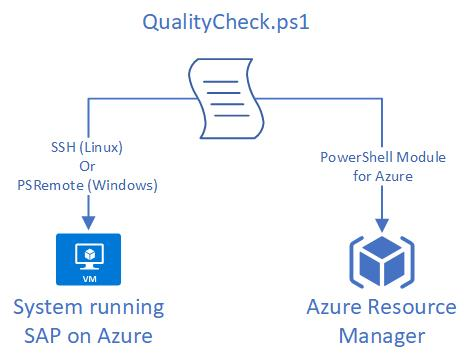

# QualityCheck for SAP on Azure

QualityCheck is an open-source tool to validate SAP on Azure installations. It connects to Azure Resource Manager and the operating system and validates the system configurations against Microsoft's best practise.
Running it regulary will always keep your system up to date.

QualityCheck supports SUSE, RedHat and Oracle Linux as well as HANA, Db2 and Oracle Database.

We are continouasly improving the tool and will add e.g. support for Windows and MSSQL in the near future.

> If you have additional ideas on what to check please open an issue.

> V1 is still available in the subfolder [here](V1)

When installing SAP on Azure please follow our guidelines available [here](https://docs.microsoft.com/en-us/azure/virtual-machines/workloads/sap/get-started).
Please pay close attention to the storage layout for HANA systems available [here](https://docs.microsoft.com/en-us/azure/virtual-machines/workloads/sap/hana-vm-operations-storage).

The certified SAP HANA on Azure instances are available in the [Certified And Supported SAP HANA Hardware Directory](https://www.sap.com/dmc/exp/2014-09-02-hana-hardware/enEN/#/solutions?filters=iaas;ve:24)

Change Log is available [here](changelog.md)

## How does it work

Quality Check is a script that runs on Windows and Linux and connects to Azure and your SAP system.
It will query your system for required parameters and match it with Microsoft's best practice.



> There is no need to install any software on the SAP on Azure operating system.
>
> The commands are query only and don't change anything on the destination system.

## What's required on jumpbox

* PowerShell 7.2 or newer, you can download Powershell [here](https://aka.ms/powershell-release?tag=stable)
* Azure Az Powershell Module (Az.Compute, Az.Network, Az.NetAppFiles, Az.Account)
* Posh-SSH Module available through PowerShell Gallery, thanks to [darkoperator](https://github.com/darkoperator/Posh-SSH)

## Getting Started on jumpbox

A jumpbox could be a special VM to access your SAP system or your local machine, we'll just call ist jumpbox.

1. Install PowerShell 7.2
    * Windows [https://docs.microsoft.com/en-us/powershell/scripting/install/installing-powershell-on-windows](https://docs.microsoft.com/en-us/powershell/scripting/install/installing-powershell-on-windows)
    * Linux [https://docs.microsoft.com/en-us/powershell/scripting/install/installing-powershell-on-linux](https://docs.microsoft.com/en-us/powershell/scripting/install/installing-powershell-on-linux)

    > Make sure not to use older versions of PowerShell which is pre-installed in Windows. Type "PowerShell 7" from Start menu

2. Install Azure Az PowerShell modules by running the following commands

    ```powershell
    Install-Module Az -Force
    Install-Module Az.NetAppFiles -Force
    Install-Module Posh-SSH -Force
    ```

    * Note that Install-Module Az -Force may take over 15 minutes to complete

3. Set the Execution Policy to unrestricted (we are working on signing the script)

    ```powershell
    Set-ExecutionPolicy Unrestricted
    ```

4. Sign in to Azure Resource Manager using

    ```powershell
    Connect-AzAccount
    ```

5. Connect to the correct subscription (see [here](https://docs.microsoft.com/en-us/powershell/module/servicemanagement/azure.service/select-azuresubscription?view=azuresmps-4.0.0) for details)

    ```powershell
    Select-AzSubscription -SubscriptionName 'your-subscription-name'
    ```

    OR

    ```powershell
    Select-AzSubscription -SubscriptionId 'your-subscription-id'
    ```

6. Download the script

    * Option 1: Clone the GitHub repo using

        ```bash
        git clone https://github.com/Azure/SAP-on-Azure-Scripts-and-Utilities.git
        ```

    * Option 2: Download the required script files using wget or curl

        ```bash
        wget https://raw.githubusercontent.com/Azure/SAP-on-Azure-Scripts-and-Utilities/main/QualityCheck/QualityCheck.ps1
        wget https://raw.githubusercontent.com/Azure/SAP-on-Azure-Scripts-and-Utilities/main/QualityCheck/QualityCheck.json
        ```

    * Option 3: Download ZIP file from GitHub and extract it on your jumpbox

        You can directly download the latest ZIP file [here](https://github.com/Azure/SAP-on-Azure-Scripts-and-Utilities/archive/refs/heads/main.zip)

### Sample Commands

```powershell
.\QualityCheck.ps1 -VMOperatingSystem Windows,SUSE,RedHat,OracleLinux -VMDatabase HANA,Oracle,MSSQL,Db2,ASE -VMRole DB,ASCS,APP -AzVMResourceGroup resourcegroupname -AzVMName AzureVMName -VMHostname hostname or ip address -VMUsername username [-HighAvailability $true or $false] [-VMConnectionPort 22>] [-DBDataDir /hana/data] [-DBLogDir /hana/log] [-DBSharedDir /hana/shared] [-ANFResourceGroup resourcegroup-for-anf] [-ANFAccountName anf-account-name] [-Hardwaretype VM] [-HANADeployment OLTP,OLAP,OLTP-ScaleOut,OLAP-ScaleOut] [-HighAvailabilityAgent SBD,FencingAgent]
```

* For Security warning message type "R" to run the script
* Then enter guest OS password

### Sample Output

You can access a sample output file [here](https://htmlpreview.github.io/?https://raw.githubusercontent.com/Azure/SAP-on-Azure-Scripts-and-Utilities/main/QualityCheck/sample/hana-sample.html)

### Full Help

```powershell
get-help .\QualityCheck.ps1 -detailed
```

## What will be checked

### General

| *Check ID*            | VM-0001 |
|:----------------------|:--------|
| *Type*                | PowerShell |
| *Command*             | if (($_jsonconfig.SupportedVMs.$_VMType.$VMRole.SupportedDB -contains $VMDatabase) -eq $true) {1} else {0} |
| *Description*         | Is the VM Type support for SAP on Azure in this scenario |
| *OS*                  | SUSE, RedHat, OracleLinux |
| *VM Role*             | DB, ASCS, APP |
| *Database*            | HANA, Db2, Oracle, MSSQL |
| *High Availability*   | yes/no |
| *Expected Value*      | supported |
| *SAP Note*            | [1928533](https://launchpad.support.sap.com/#/notes/1928533) |
| *Microsoft link*      |  |
| *added/modified*      | initial version |  

| *Check ID*            | VM-0002 |
|:----------------------|:--------|
| *Type*                | PowerShell |
| *Command*             | if (($_jsonconfig.SupportedVMs.$_VMType.$VMRole.HANAScenario.$HANADeployment -like '*Sizing') -eq $true) {1} else {0}" |
| *Description*         | Is the VM Type support for the specified HANA workload |
| *OS*                  | SUSE, RedHat |
| *VM Role*             | DB |
| *Database*            | HANA |
| *High Availability*   | no/yes (SBD/FencingAgent) |
| *Expected Value*      | supported |
| *SAP Note*            | [1928533](https://launchpad.support.sap.com/#/notes/1928533) |
| *Microsoft link*      | SAP HANA Certified Hardware Directory, link [here](https://www.sap.com/dmc/exp/2014-09-02-hana-hardware/enEN/#/solutions?filters=iaas;ve:24) |
| *added/modified*      | initial version |

| *Check ID*            | VM-0003 |
|:----------------------|:--------|
| *Type*                | PowerShell |
| *Command*             | if (($_jsonconfig.SupportedOSDBCombinations.$VMDatabase.$VMRole -contains $VMOperatingSystem) -eq $true) {1} else {0} |
| *Description*         | Is OS/DB combination supported for SAP on Azure |
| *OS*                  | SUSE, RedHat, OracleLinux, Windows |
| *VM Role*             | DB, ASCS, APP |
| *Database*            | HANA, Db2, Oracle, MSSQL |
| *High Availability*   | no/yes (SBD/FencingAgent) |
| *Expected Value*      | supported |
| *SAP Note*            | [1928533](https://launchpad.support.sap.com/#/notes/1928533) |
| *Microsoft link*      | |
| *added/modified*      | initial version |

| *Check ID*            | VM-0004 |
|:----------------------|:--------|
| *Type*                | PowerShell |
| *Command*             | if (($script:_NetworkInterfaces | Where-Object { $_.AcceleratedNetworking -eq $false } | Measure-Object).Count -eq 0) { 'OK' } else { 'ERROR'} |
| *Description*         | Check if Accelerated Networking is enabled on all interfaces |
| *OS*                  | SUSE, RedHat, OracleLinux, Windows |
| *VM Role*             | DB, ASCS, APP |
| *Database*            | HANA, Db2, Oracle, MSSQL |
| *High Availability*   | no/yes (SBD/FencingAgent) |
| *Expected Value*      | supported |
| *SAP Note*            | [1928533](https://launchpad.support.sap.com/#/notes/1928533) |
| *Microsoft link*      | |
| *added/modified*      | initial version |

| *Check ID*            | OS-0001 |
|:----------------------|:--------|
| *Type*                | OS |
| *Command*             | systemctl &#124; grep fstrim &#124; grep active &#124; wc -l |
| *Description*         | fstrim disabled |
| *OS*                  | SLES, RedHat, OracleLinux |
| *VM Role*             | DB |
| *Database*            | HANA |
| *High Availability*   | n/a |
| *Expected Value*      | fstrim should be disabled |
| *SAP Note*            | |
| *Microsoft link*      | |
| *added/modified*      | initial version |

### ASCS

| *Check ID*            | ASCS-NET-0001 |
|:----------------------|:--------|
| *Type*                | OS |
| *Command*             | sysctl net.ipv4.tcp_timestamps |
| *Description*         | Timestamp parameter for HA Load Balancers |
| *OS*                  | SUSE, RedHat |
| *VM Role*             | ASCS |
| *Database*            | HANA, Db2, Oracle |
| *High Availability*   | yes (SBD/FencingAgent) |
| *Expected Value*      | 0 |
| *SAP Note*            | [2382421](https://launchpad.support.sap.com/#/notes/2382421) |
| *Microsoft link*      | multiple links, e.g. [here](https://docs.microsoft.com/en-us/azure/virtual-machines/workloads/sap/high-availability-guide-suse-nfs-azure-files) for SUSE and [here](https://docs.microsoft.com/en-us/azure/virtual-machines/workloads/sap/high-availability-guide-rhel-nfs-azure-files) for RedHat |
| *added/modified*      | initial version |  

### Database General

| *Check ID*            | DB-NET-0001 |
|:----------------------|:--------|
| *Type*                | OS |
| *Command*             | sysctl net.ipv4.tcp_timestamps |
| *Description*         | Timestamp parameter for HA Load Balancers |
| *OS*                  | SUSE, RedHat |
| *VM Role*             | DB |
| *Database*            | HANA, Db2 |
| *High Availability*   | yes (SBD/FencingAgent) |
| *Expected Value*      | 0 |
| *SAP Note*            | [2382421](https://launchpad.support.sap.com/#/notes/2382421) |
| *Microsoft link*      | multiple docs sites, e.g. [here](https://docs.microsoft.com/en-us/azure/virtual-machines/workloads/sap/high-availability-guide-suse-nfs-azure-files) |
| *added/modified*      | initial version |

### HANA

| *Check ID*            | HDB-OS-0001 |
|:----------------------|:--------|
| *Type*                | OS |
| *Command*             | sysctl net.ipv4.ip_local_port_range |
| *Description*         | Optimizing the Network Configuration on HANA- and OS-Level |
| *OS*                  | SUSE, RedHat |
| *VM Role*             | DB |
| *Database*            | HANA |
| *High Availability*   | no/yes (SBD/FencingAgent) |
| *Expected Value*      | 9000 65499 |
| *SAP Note*            | [2382421](https://launchpad.support.sap.com/#/notes/2382421) |
| *Microsoft link*      | |
| *added/modified*      | initial version |  

| *Check ID*            | HDB-OS-0002 |
|:----------------------|:--------|
| *Type*                | OS |
| *Command*             | free &#124; grep Swap &#124; awk '{print $2}' |
| *Description*         | swap space |
| *OS*                  | SUSE, RedHat |
| *VM Role*             | DB |
| *Database*            | HANA |
| *High Availability*   | no/yes (SBD/FencingAgent) |
| *Expected Value*      | 2GB |
| *SAP Note*            | [1999997](https://launchpad.support.sap.com/#/notes/1999997) |
| *Microsoft link*      | |
| *added/modified*      | initial version |

| *Check ID*            | HDB-FS-0001 |
|:----------------------|:--------|
| *Type*                | OS |
| *Command*             | see script |
| *Description*         | SAP HANA data filesystem type xfs, nfs or nfs4 |
| *OS*                  | SUSE, RedHat |
| *VM Role*             | DB |
| *Database*            | HANA |
| *High Availability*   | no/yes (SBD/FencingAgent) |
| *Expected Value*      | xfs, nfs or nfs4 |
| *SAP Note*            | [2972496](https://launchpad.support.sap.com/#/notes/2972496) |
| *Microsoft link*      | |
| *added/modified*      | initial version |

| *Check ID*            | HDB-FS-0002 |
|:----------------------|:--------|
| *Type*                | OS |
| *Command*             | see script |
| *Description*         | SAP HANA data filesystem needs to have >= 400 MB/s |
| *OS*                  | SUSE, RedHat |
| *VM Role*             | DB |
| *Database*            | HANA |
| *High Availability*   | no/yes (SBD/FencingAgent) |
| *Expected Value*      | >= 400 MB/s |
| *SAP Note*            | |
| *Microsoft link*      | [https://docs.microsoft.com/en-us/azure/virtual-machines/workloads/sap/hana-vm-operations-storage](https://docs.microsoft.com/en-us/azure/virtual-machines/workloads/sap/hana-vm-operations-storage) |
| *added/modified*      | initial version |

| *Check ID*            | HDB-FS-0003 |
|:----------------------|:--------|
| *Type*                | OS |
| *Command*             | see script |
| *Description*         | SAP HANA data filesystem needs to have >= 7000 IOPS |
| *OS*                  | SUSE, RedHat |
| *VM Role*             | DB |
| *Database*            | HANA |
| *High Availability*   | no/yes (SBD/FencingAgent) |
| *Expected Value*      | >= 7000 IOPS |
| *SAP Note*            | |
| *Microsoft link*      | [https://docs.microsoft.com/en-us/azure/virtual-machines/workloads/sap/hana-vm-operations-storage](https://docs.microsoft.com/en-us/azure/virtual-machines/workloads/sap/hana-vm-operations-storage) |
| *added/modified*      | initial version |

| *Check ID*            | HDB-FS-0004 |
|:----------------------|:--------|
| *Type*                | OS |
| *Command*             | see script |
| *Description*         | SAP HANA data filesystem size needs to be 256kb when striped |
| *OS*                  | SUSE, RedHat |
| *VM Role*             | DB |
| *Database*            | HANA |
| *High Availability*   | no/yes (SBD/FencingAgent) |
| *Expected Value*      | 256kb stripe size |
| *SAP Note*            | |
| *Microsoft link*      | [https://docs.microsoft.com/en-us/azure/virtual-machines/workloads/sap/hana-vm-operations-storage](https://docs.microsoft.com/en-us/azure/virtual-machines/workloads/sap/hana-vm-operations-storage) |
| *added/modified*      | initial version |

| *Check ID*            | HDB-FS-0005 |
|:----------------------|:--------|
| *Type*                | OS |
| *Command*             | see script |
| *Description*         | SAP HANA data filesystem disks in LVM need to be of same disk type |
| *OS*                  | SUSE, RedHat |
| *VM Role*             | DB |
| *Database*            | HANA |
| *High Availability*   | no/yes (SBD/FencingAgent) |
| *Expected Value*      | all disks same disk type |
| *SAP Note*            | |
| *Microsoft link*      | [https://docs.microsoft.com/en-us/azure/virtual-machines/workloads/sap/hana-vm-operations-storage](https://docs.microsoft.com/en-us/azure/virtual-machines/workloads/sap/hana-vm-operations-storage) |
| *added/modified*      | initial version |

| *Check ID*            | HDB-FS-0006 |
|:----------------------|:--------|
| *Type*                | OS |
| *Command*             | see script |
| *Description*         | SAP HANA data filesystem disks in LVM need to be of same disk performance type |
| *OS*                  | SUSE, RedHat |
| *VM Role*             | DB |
| *Database*            | HANA |
| *High Availability*   | no/yes (SBD/FencingAgent) |
| *Expected Value*      | all disks same disk performance type |
| *SAP Note*            | |
| *Microsoft link*      | [https://docs.microsoft.com/en-us/azure/virtual-machines/workloads/sap/hana-vm-operations-storage](https://docs.microsoft.com/en-us/azure/virtual-machines/workloads/sap/hana-vm-operations-storage) |
| *added/modified*      | initial version |

| *Check ID*            | HDB-FS-0007 |
|:----------------------|:--------|
| *Type*                | OS |
| *Command*             | see script |
| *Description*         | SAP HANA log filesystem type xfs, nfs or nfs4 |
| *OS*                  | SUSE, RedHat |
| *VM Role*             | DB |
| *Database*            | HANA |
| *High Availability*   | no/yes (SBD/FencingAgent) |
| *Expected Value*      | xfs, nfs or nfs4 |
| *SAP Note*            | [2972496](https://launchpad.support.sap.com/#/notes/2972496) |
| *Microsoft link*      | |
| *added/modified*      | initial version |

| *Check ID*            | HDB-FS-0008 |
|:----------------------|:--------|
| *Type*                | OS |
| *Command*             | see script |
| *Description*         | SAP HANA log filesystem needs to have >= 250 MB/s |
| *OS*                  | SUSE, RedHat |
| *VM Role*             | DB |
| *Database*            | HANA |
| *High Availability*   | no/yes (SBD/FencingAgent) |
| *Expected Value*      | >= 250 MB/s |
| *SAP Note*            | |
| *Microsoft link*      | [https://docs.microsoft.com/en-us/azure/virtual-machines/workloads/sap/hana-vm-operations-storage](https://docs.microsoft.com/en-us/azure/virtual-machines/workloads/sap/hana-vm-operations-storage) |
| *added/modified*      | initial version |

| *Check ID*            | HDB-FS-0009 |
|:----------------------|:--------|
| *Type*                | OS |
| *Command*             | see script |
| *Description*         | SAP HANA log filesystem needs to have >= 2000 IOPS |
| *OS*                  | SUSE, RedHat |
| *VM Role*             | DB |
| *Database*            | HANA |
| *High Availability*   | no/yes (SBD/FencingAgent) |
| *Expected Value*      | >= 2000 IOPS |
| *SAP Note*            | |
| *Microsoft link*      | [https://docs.microsoft.com/en-us/azure/virtual-machines/workloads/sap/hana-vm-operations-storage](https://docs.microsoft.com/en-us/azure/virtual-machines/workloads/sap/hana-vm-operations-storage) |
| *added/modified*      | initial version |

| *Check ID*            | HDB-FS-0010 |
|:----------------------|:--------|
| *Type*                | OS |
| *Command*             | see script |
| *Description*         | SAP HANA log filesystem size needs to be 64kb when striped |
| *OS*                  | SUSE, RedHat |
| *VM Role*             | DB |
| *Database*            | HANA |
| *High Availability*   | no/yes (SBD/FencingAgent) |
| *Expected Value*      | 64kb stripe size |
| *SAP Note*            | |
| *Microsoft link*      | [https://docs.microsoft.com/en-us/azure/virtual-machines/workloads/sap/hana-vm-operations-storage](https://docs.microsoft.com/en-us/azure/virtual-machines/workloads/sap/hana-vm-operations-storage) |
| *added/modified*      | initial version |

| *Check ID*            | HDB-FS-0011 |
|:----------------------|:--------|
| *Type*                | OS |
| *Command*             | see script |
| *Description*         | SAP HANA log filesystem disks in LVM need to be of same disk type |
| *OS*                  | SUSE, RedHat |
| *VM Role*             | DB |
| *Database*            | HANA |
| *High Availability*   | no/yes (SBD/FencingAgent) |
| *Expected Value*      | all disks same disk type |
| *SAP Note*            | |
| *Microsoft link*      | [https://docs.microsoft.com/en-us/azure/virtual-machines/workloads/sap/hana-vm-operations-storage](https://docs.microsoft.com/en-us/azure/virtual-machines/workloads/sap/hana-vm-operations-storage) |
| *added/modified*      | initial version |

| *Check ID*            | HDB-FS-0012 |
|:----------------------|:--------|
| *Type*                | OS |
| *Command*             | see script |
| *Description*         | SAP HANA log filesystem disks in LVM need to be of same disk performance type |
| *OS*                  | SUSE, RedHat |
| *VM Role*             | DB |
| *Database*            | HANA |
| *High Availability*   | no/yes (SBD/FencingAgent) |
| *Expected Value*      | all disks same disk performance type |
| *SAP Note*            | |
| *Microsoft link*      | [https://docs.microsoft.com/en-us/azure/virtual-machines/workloads/sap/hana-vm-operations-storage](https://docs.microsoft.com/en-us/azure/virtual-machines/workloads/sap/hana-vm-operations-storage) |
| *added/modified*      | initial version |

| *Check ID*            | HDB-FS-0013 |
|:----------------------|:--------|
| *Type*                | OS |
| *Command*             | see script |
| *Description*         | SAP HANA log filesystem disks need to have Write Acclerator enabled for Premium_LRS disks |
| *OS*                  | SUSE, RedHat |
| *VM Role*             | DB |
| *Database*            | HANA |
| *High Availability*   | no/yes (SBD/FencingAgent) |
| *Expected Value*      | Write Accelerator enabled |
| *SAP Note*            | |
| *Microsoft link*      | [https://docs.microsoft.com/en-us/azure/virtual-machines/workloads/sap/hana-vm-operations-storage](https://docs.microsoft.com/en-us/azure/virtual-machines/workloads/sap/hana-vm-operations-storage) |
| *added/modified*      | initial version |

| *Check ID*            | HDB-FS-0014 |
|:----------------------|:--------|
| *Type*                | OS |
| *Command*             | see script |
| *Description*         | SAP HANA shared filesystem type xfs, nfs or nfs4 |
| *OS*                  | SUSE, RedHat |
| *VM Role*             | DB |
| *Database*            | HANA |
| *High Availability*   | no/yes (SBD/FencingAgent) |
| *Expected Value*      | xfs, nfs or nfs4 |
| *SAP Note*            | [2972496](https://launchpad.support.sap.com/#/notes/2972496) |
| *Microsoft link*      | |
| *added/modified*      | initial version |

| *Check ID*            | HDB-ANF-0001 |
|:----------------------|:--------|
| *Type*                | OS |
| *Command*             | sysctl net.core.rmem_max |
| *Description*         | OS parameter for ANF performance |
| *OS*                  | SUSE, RedHat |
| *VM Role*             | DB |
| *Database*            | HANA |
| *High Availability*   | no/yes (SBD/FencingAgent) |
| *Expected Value*      | 16777216 |
| *SAP Note*            | |
| *Microsoft link*      | multiple docs sites, e.g. [here](https://docs.microsoft.com/en-us/azure/virtual-machines/workloads/sap/sap-hana-scale-out-standby-netapp-files-suse) |
| *added/modified*      | initial version |

| *Check ID*            | HDB-ANF-0002 |
|:----------------------|:--------|
| *Type*                | OS |
| *Command*             | sysctl net.core.wmem_max |
| *Description*         | OS parameter for ANF performance |
| *OS*                  | SUSE, RedHat |
| *VM Role*             | DB |
| *Database*            | HANA |
| *High Availability*   | no/yes (SBD/FencingAgent) |
| *Expected Value*      | 16777216 |
| *SAP Note*            | |
| *Microsoft link*      | multiple docs sites, e.g. [here](https://docs.microsoft.com/en-us/azure/virtual-machines/workloads/sap/sap-hana-scale-out-standby-netapp-files-suse) |
| *added/modified*      | initial version |

| *Check ID*            | HDB-ANF-0003 |
|:----------------------|:--------|
| *Type*                | OS |
| *Command*             | sysctl net.core.rmem_default |
| *Description*         | OS parameter for ANF performance |
| *OS*                  | SUSE, RedHat |
| *VM Role*             | DB |
| *Database*            | HANA |
| *High Availability*   | no/yes (SBD/FencingAgent) |
| *Expected Value*      | 16777216 |
| *SAP Note*            | |
| *Microsoft link*      | multiple docs sites, e.g. [here](https://docs.microsoft.com/en-us/azure/virtual-machines/workloads/sap/sap-hana-scale-out-standby-netapp-files-suse) |
| *added/modified*      | initial version |

| *Check ID*            | HDB-ANF-0004 |
|:----------------------|:--------|
| *Type*                | OS |
| *Command*             | sysctl net.core.wmem_default |
| *Description*         | OS parameter for ANF performance |
| *OS*                  | SUSE, RedHat |
| *VM Role*             | DB |
| *Database*            | HANA |
| *High Availability*   | no/yes (SBD/FencingAgent) |
| *Expected Value*      | 16777216 |
| *SAP Note*            | |
| *Microsoft link*      | multiple docs sites, e.g. [here](https://docs.microsoft.com/en-us/azure/virtual-machines/workloads/sap/sap-hana-scale-out-standby-netapp-files-suse) |
| *added/modified*      | initial version |

| *Check ID*            | HDB-ANF-0005 |
|:----------------------|:--------|
| *Type*                | OS |
| *Command*             | sysctl net.core.optmem_max |
| *Description*         | OS parameter for ANF performance |
| *OS*                  | SUSE, RedHat |
| *VM Role*             | DB |
| *Database*            | HANA |
| *High Availability*   | no/yes (SBD/FencingAgent) |
| *Expected Value*      | 16777216 |
| *SAP Note*            | |
| *Microsoft link*      | multiple docs sites, e.g. [here](https://docs.microsoft.com/en-us/azure/virtual-machines/workloads/sap/sap-hana-scale-out-standby-netapp-files-suse) |
| *added/modified*      | initial version |

| *Check ID*            | HDB-ANF-0006 |
|:----------------------|:--------|
| *Type*                | OS |
| *Command*             | sysctl net.ipv4.tcp_rmem |
| *Description*         | OS parameter for ANF performance |
| *OS*                  | SUSE, RedHat |
| *VM Role*             | DB |
| *Database*            | HANA |
| *High Availability*   | no/yes (SBD/FencingAgent) |
| *Expected Value*      | 65536 16777216 16777216 |
| *SAP Note*            | |
| *Microsoft link*      | multiple docs sites, e.g. [here](https://docs.microsoft.com/en-us/azure/virtual-machines/workloads/sap/sap-hana-scale-out-standby-netapp-files-suse) |
| *added/modified*      | initial version |

| *Check ID*            | HDB-ANF-0007 |
|:----------------------|:--------|
| *Type*                | OS |
| *Command*             | sysctl net.ipv4.tcp_wmem |
| *Description*         | OS parameter for ANF performance |
| *OS*                  | SUSE, RedHat |
| *VM Role*             | DB |
| *Database*            | HANA |
| *High Availability*   | no/yes (SBD/FencingAgent) |
| *Expected Value*      | 65536 16777216 16777216 |
| *SAP Note*            | |
| *Microsoft link*      | multiple docs sites, e.g. [here](https://docs.microsoft.com/en-us/azure/virtual-machines/workloads/sap/sap-hana-scale-out-standby-netapp-files-suse) |
| *added/modified*      | initial version |

| *Check ID*            | HDB-ANF-0008 |
|:----------------------|:--------|
| *Type*                | OS |
| *Command*             | sysctl net.core.netdev_max_backlog |
| *Description*         | OS parameter for ANF performance |
| *OS*                  | SUSE, RedHat |
| *VM Role*             | DB |
| *Database*            | HANA |
| *High Availability*   | no/yes (SBD/FencingAgent) |
| *Expected Value*      | 300000 |
| *SAP Note*            | |
| *Microsoft link*      | multiple docs sites, e.g. [here](https://docs.microsoft.com/en-us/azure/virtual-machines/workloads/sap/sap-hana-scale-out-standby-netapp-files-suse) |
| *added/modified*      | initial version |

| *Check ID*            | HDB-ANF-0009 |
|:----------------------|:--------|
| *Type*                | OS |
| *Command*             | sysctl net.ipv4.tcp_slow_start_after_idle |
| *Description*         | OS parameter for ANF performance |
| *OS*                  | SUSE, RedHat |
| *VM Role*             | DB |
| *Database*            | HANA |
| *High Availability*   | no/yes (SBD/FencingAgent) |
| *Expected Value*      | 0 |
| *SAP Note*            | |
| *Microsoft link*      | multiple docs sites, e.g. [here](https://docs.microsoft.com/en-us/azure/virtual-machines/workloads/sap/sap-hana-scale-out-standby-netapp-files-suse) |
| *added/modified*      | initial version |

| *Check ID*            | HDB-ANF-0010 |
|:----------------------|:--------|
| *Type*                | OS |
| *Command*             | sysctl net.ipv4.tcp_moderate_rcvbuf |
| *Description*         | OS parameter for ANF performance |
| *OS*                  | SUSE, RedHat |
| *VM Role*             | DB |
| *Database*            | HANA |
| *High Availability*   | no/yes (SBD/FencingAgent) |
| *Expected Value*      | 1 |
| *SAP Note*            | |
| *Microsoft link*      | multiple docs sites, e.g. [here](https://docs.microsoft.com/en-us/azure/virtual-machines/workloads/sap/sap-hana-scale-out-standby-netapp-files-suse) |
| *added/modified*      | initial version |

| *Check ID*            | HDB-ANF-0011 |
|:----------------------|:--------|
| *Type*                | OS |
| *Command*             | sysctl net.ipv4.tcp_window_scaling |
| *Description*         | OS parameter for ANF performance |
| *OS*                  | SUSE, RedHat |
| *VM Role*             | DB |
| *Database*            | HANA |
| *High Availability*   | no/yes (SBD/FencingAgent) |
| *Expected Value*      | 1 |
| *SAP Note*            | |
| *Microsoft link*      | multiple docs sites, e.g. [here](https://docs.microsoft.com/en-us/azure/virtual-machines/workloads/sap/sap-hana-scale-out-standby-netapp-files-suse) |
| *added/modified*      | initial version |

| *Check ID*            | HDB-ANF-0012 |
|:----------------------|:--------|
| *Type*                | OS |
| *Command*             | sysctl net.ipv4.tcp_timestamps |
| *Description*         | OS parameter for ANF performance |
| *OS*                  | SUSE, RedHat |
| *VM Role*             | DB |
| *Database*            | HANA (Scale-Out) |
| *High Availability*   | no |
| *Expected Value*      | 1 |
| *SAP Note*            | |
| *Microsoft link*      | multiple docs sites, e.g. [here](https://docs.microsoft.com/en-us/azure/virtual-machines/workloads/sap/sap-hana-scale-out-standby-netapp-files-suse) |
| *added/modified*      | initial version |

| *Check ID*            | HDB-ANF-0013 |
|:----------------------|:--------|
| *Type*                | OS |
| *Command*             | sysctl net.ipv4.tcp_timestamps |
| *Description*         | OS parameter for ANF performance |
| *OS*                  | SUSE, RedHat |
| *VM Role*             | DB |
| *Database*            | HANA (Scale-Out) |
| *High Availability*   | yes (SBD/FencingAgent) |
| *Expected Value*      | 0 |
| *SAP Note*            | |
| *Microsoft link*      | multiple docs sites, e.g. [here](https://docs.microsoft.com/en-us/azure/virtual-machines/workloads/sap/sap-hana-scale-out-standby-netapp-files-suse) |
| *added/modified*      | initial version |

| *Check ID*            | HDB-ANF-0014 |
|:----------------------|:--------|
| *Type*                | OS |
| *Command*             | sysctl net.ipv4.tcp_sack |
| *Description*         | OS parameter for ANF performance |
| *OS*                  | SUSE, RedHat |
| *VM Role*             | DB |
| *Database*            | HANA |
| *High Availability*   | no/yes (SBD/FencingAgent) |
| *Expected Value*      | 1 |
| *SAP Note*            | |
| *Microsoft link*      | multiple docs sites, e.g. [here](https://docs.microsoft.com/en-us/azure/virtual-machines/workloads/sap/sap-hana-scale-out-standby-netapp-files-suse) |
| *added/modified*      | initial version |

| *Check ID*            | HDB-ANF-0015 |
|:----------------------|:--------|
| *Type*                | OS |
| *Command*             | sysctl ipv6.conf.all.disable_ipv6 |
| *Description*         | OS parameter for ANF performance |
| *OS*                  | SUSE, RedHat |
| *VM Role*             | DB |
| *Database*            | HANA |
| *High Availability*   | no/yes (SBD/FencingAgent) |
| *Expected Value*      | 1 |
| *SAP Note*            | |
| *Microsoft link*      | multiple docs sites, e.g. [here](https://docs.microsoft.com/en-us/azure/virtual-machines/workloads/sap/sap-hana-scale-out-standby-netapp-files-suse) |
| *added/modified*      | initial version |

| *Check ID*            | HDB-ANF-0016 |
|:----------------------|:--------|
| *Type*                | OS |
| *Command*             | sysctl net.ipv4.tcp_max_syn_backlog |
| *Description*         | OS parameter for ANF performance |
| *OS*                  | SUSE, RedHat |
| *VM Role*             | DB |
| *Database*            | HANA |
| *High Availability*   | no/yes (SBD/FencingAgent) |
| *Expected Value*      | 16348 |
| *SAP Note*            | |
| *Microsoft link*      | multiple docs sites, e.g. [here](https://docs.microsoft.com/en-us/azure/virtual-machines/workloads/sap/sap-hana-scale-out-standby-netapp-files-suse) |
| *added/modified*      | initial version |

| *Check ID*            | HDB-ANF-0017 |
|:----------------------|:--------|
| *Type*                | OS |
| *Command*             | sysctl net.ipv4.ip_local_port_range |
| *Description*         | OS parameter for ANF performance |
| *OS*                  | SUSE, RedHat |
| *VM Role*             | DB |
| *Database*            | HANA |
| *High Availability*   | no/yes (SBD/FencingAgent) |
| *Expected Value*      | 9000 65499 |
| *SAP Note*            | |
| *Microsoft link*      | multiple docs sites, e.g. [here](https://docs.microsoft.com/en-us/azure/virtual-machines/workloads/sap/sap-hana-scale-out-standby-netapp-files-suse) |
| *added/modified*      | initial version |

| *Check ID*            | HDB-ANF-0018 |
|:----------------------|:--------|
| *Type*                | OS |
| *Command*             | sysctl net.ipv4.conf.all.rp_filter |
| *Description*         | OS parameter for ANF performance |
| *OS*                  | SUSE, RedHat |
| *VM Role*             | DB |
| *Database*            | HANA |
| *High Availability*   | no/yes (SBD/FencingAgent) |
| *Expected Value*      | 0 |
| *SAP Note*            | |
| *Microsoft link*      | multiple docs sites, e.g. [here](https://docs.microsoft.com/en-us/azure/virtual-machines/workloads/sap/sap-hana-scale-out-standby-netapp-files-suse) |
| *added/modified*      | initial version |

| *Check ID*            | HDB-ANF-0019 |
|:----------------------|:--------|
| *Type*                | OS |
| *Command*             | sysctl sunrpc.tcp_slot_table_entries |
| *Description*         | OS parameter for ANF performance |
| *OS*                  | SUSE, RedHat |
| *VM Role*             | DB |
| *Database*            | HANA |
| *High Availability*   | no/yes (SBD/FencingAgent) |
| *Expected Value*      | 128 |
| *SAP Note*            | |
| *Microsoft link*      | multiple docs sites, e.g. [here](https://docs.microsoft.com/en-us/azure/virtual-machines/workloads/sap/sap-hana-scale-out-standby-netapp-files-suse) |
| *added/modified*      | initial version |

| *Check ID*            | HDB-ANF-0020 |
|:----------------------|:--------|
| *Type*                | OS |
| *Command*             | sysctl vm.swappiness |
| *Description*         | OS parameter for ANF performance |
| *OS*                  | SUSE, RedHat |
| *VM Role*             | DB |
| *Database*            | HANA |
| *High Availability*   | no/yes (SBD/FencingAgent) |
| *Expected Value*      | 10 |
| *SAP Note*            | |
| *Microsoft link*      | multiple docs sites, e.g. [here](https://docs.microsoft.com/en-us/azure/virtual-machines/workloads/sap/sap-hana-scale-out-standby-netapp-files-suse) |
| *added/modified*      | initial version |

| *Check ID*            | HDB-ANF-0021 |
|:----------------------|:--------|
| *Type*                | OS |
| *Command*             | cat /etc/modprobe.d/* &#124; grep tcp_max_slot_table_entries |
| *Description*         | OS parameter for ANF performance |
| *OS*                  | SUSE, RedHat |
| *VM Role*             | DB |
| *Database*            | HANA |
| *High Availability*   | no/yes (SBD/FencingAgent) |
| *Expected Value*      | options sunrpc tcp_max_slot_table_entries=128 |
| *SAP Note*            | |
| *Microsoft link*      | multiple docs sites, e.g. [here](https://docs.microsoft.com/en-us/azure/virtual-machines/workloads/sap/sap-hana-scale-out-standby-netapp-files-suse) |
| *added/modified*      | initial version |

| *Check ID*            | HDB-RH-0001 |
|:----------------------|:--------|
| *Type*                | OS |
| *Command*             | tuned-adm active |
| *Description*         | OS parameter for ANF performance |
| *OS*                  | RedHat |
| *VM Role*             | DB |
| *Database*            | HANA |
| *High Availability*   | no/yes (SBD/FencingAgent) |
| *Expected Value*      | Current active profile: sap-hana |
| *SAP Note*            | |
| *Microsoft link*      | multiple docs sites, e.g. [here](https://docs.microsoft.com/en-us/azure/virtual-machines/workloads/sap/sap-hana-scale-out-standby-netapp-files-suse) |
| *added/modified*      | initial version |

| *Check ID*            | HDB-HA-SLE-0001 |
|:----------------------|:--------|
| *Type*                | OS |
| *Command*             | crm configure show &#124; grep 'PREFER_SITE_TAKEOVER=true' &#124; wc -l |
| *Description*         | SAP HANA Automatic Site Takeover |
| *OS*                  | SUSE |
| *VM Role*             | DB |
| *Database*            | HANA |
| *High Availability*   | yes (SBD/FencingAgent) |
| *Expected Value*      | 1 |
| *SAP Note*            | |
| *Microsoft link*      | multiple docs sites, e.g. [here](https://docs.microsoft.com/en-us/azure/virtual-machines/workloads/sap/sap-hana-high-availability) |
| *added/modified*      | initial version |

| *Check ID*            | HDB-HA-SLE-0002 |
|:----------------------|:--------|
| *Type*                | OS |
| *Command*             | crm configure show &#124; grep 'AUTOMATED_REGISTER=true' &#124; wc -l |
| *Description*         | SAP HANA Automated Register |
| *OS*                  | SUSE |
| *VM Role*             | DB |
| *Database*            | HANA |
| *High Availability*   | yes (SBD/FencingAgent) |
| *Expected Value*      | 1 |
| *SAP Note*            | |
| *Microsoft link*      | multiple docs sites, e.g. [here](https://docs.microsoft.com/en-us/azure/virtual-machines/workloads/sap/sap-hana-high-availability) |
| *added/modified*      | initial version |

| *Check ID*            | HDB-HA-SLE-0003 |
|:----------------------|:--------|
| *Type*                | OS |
| *Command*             | crm configure show &#124; grep 'stonith-enabled=true' &#124; wc -l |
| *Description*         | Pacemaker Stonith enabled |
| *OS*                  | SUSE |
| *VM Role*             | DB |
| *Database*            | HANA |
| *High Availability*   | yes (SBD/FencingAgent) |
| *Expected Value*      | 1 |
| *SAP Note*            | |
| *Microsoft link*      | multiple docs sites, e.g. [here](https://docs.microsoft.com/en-us/azure/virtual-machines/workloads/sap/sap-hana-high-availability) |
| *added/modified*      | initial version |

| *Check ID*            | HDB-HA-SLE-0004 |
|:----------------------|:--------|
| *Type*                | OS |
| *Command*             | crm configure show &#124; grep 'stonith-timeout=144' &#124; wc -l |
| *Description*         | Pacemaker Stonith timeout |
| *OS*                  | SUSE |
| *VM Role*             | DB |
| *Database*            | HANA |
| *High Availability*   | yes (SBD) |
| *Expected Value*      | stonith-timeout=144 |
| *SAP Note*            | |
| *Microsoft link*      | multiple docs sites, e.g. [here](https://docs.microsoft.com/en-us/azure/virtual-machines/workloads/sap/sap-hana-high-availability) |
| *added/modified*      | initial version |

| *Check ID*            | HDB-HA-SLE-0005 |
|:----------------------|:--------|
| *Type*                | OS |
| *Command*             | crm corosync get totem.token |
| *Description*         | Pacemaker corosync token |
| *OS*                  | SUSE |
| *VM Role*             | DB |
| *Database*            | HANA |
| *High Availability*   | yes (SBD/FencingAgent) |
| *Expected Value*      | 30000 |
| *SAP Note*            | |
| *Microsoft link*      | multiple docs sites, e.g. [here](https://docs.microsoft.com/en-us/azure/virtual-machines/workloads/sap/sap-hana-high-availability) |
| *added/modified*      | initial version |

| *Check ID*            | HDB-HA-SLE-0006 |
|:----------------------|:--------|
| *Type*                | OS |
| *Command*             | crm corosync get totem.token_retransmits_before_loss_const |
| *Description*         | Pacemaker totem.token_retransmits_before_loss_const |
| *OS*                  | SUSE |
| *VM Role*             | DB |
| *Database*            | HANA |
| *High Availability*   | yes (SBD/FencingAgent) |
| *Expected Value*      | 10 |
| *SAP Note*            | |
| *Microsoft link*      | multiple docs sites, e.g. [here](https://docs.microsoft.com/en-us/azure/virtual-machines/workloads/sap/sap-hana-high-availability) |
| *added/modified*      | initial version |

| *Check ID*            | HDB-HA-SLE-0007 |
|:----------------------|:--------|
| *Type*                | OS |
| *Command*             | crm corosync get totem.join |
| *Description*         | Pacemaker corosync join |
| *OS*                  | SUSE |
| *VM Role*             | DB |
| *Database*            | HANA |
| *High Availability*   | yes (SBD/FencingAgent) |
| *Expected Value*      | 60 |
| *SAP Note*            | |
| *Microsoft link*      | multiple docs sites, e.g. [here](https://docs.microsoft.com/en-us/azure/virtual-machines/workloads/sap/sap-hana-high-availability) |
| *added/modified*      | initial version |

| *Check ID*            | HDB-HA-SLE-0008 |
|:----------------------|:--------|
| *Type*                | OS |
| *Command*             | crm corosync get totem.consensus |
| *Description*         | Pacemaker corosync consensus |
| *OS*                  | SUSE |
| *VM Role*             | DB |
| *Database*            | HANA |
| *High Availability*   | yes (SBD/FencingAgent) |
| *Expected Value*      | 36000 |
| *SAP Note*            | |
| *Microsoft link*      | multiple docs sites, e.g. [here](https://docs.microsoft.com/en-us/azure/virtual-machines/workloads/sap/sap-hana-high-availability) |
| *added/modified*      | initial version |

| *Check ID*            | HDB-HA-SLE-0009 |
|:----------------------|:--------|
| *Type*                | OS |
| *Command*             | crm corosync get totem.max_messages |
| *Description*         | Pacemaker corosync max_messages |
| *OS*                  | SUSE |
| *VM Role*             | DB |
| *Database*            | HANA |
| *High Availability*   | yes (SBD/FencingAgent) |
| *Expected Value*      | 20 |
| *SAP Note*            | |
| *Microsoft link*      | multiple docs sites, e.g. [here](https://docs.microsoft.com/en-us/azure/virtual-machines/workloads/sap/sap-hana-high-availability) |
| *added/modified*      | initial version |

| *Check ID*            | HDB-HA-SLE-0010 |
|:----------------------|:--------|
| *Type*                | OS |
| *Command*             | crm corosync get quorum.expected_votes |
| *Description*         | Pacemaker corosync expected_votes |
| *OS*                  | SUSE |
| *VM Role*             | DB |
| *Database*            | HANA |
| *High Availability*   | yes (SBD/FencingAgent) |
| *Expected Value*      | 2 |
| *SAP Note*            | |
| *Microsoft link*      | multiple docs sites, e.g. [here](https://docs.microsoft.com/en-us/azure/virtual-machines/workloads/sap/sap-hana-high-availability) |
| *added/modified*      | initial version |

| *Check ID*            | HDB-HA-SLE-0011 |
|:----------------------|:--------|
| *Type*                | OS |
| *Command*             | crm corosync get quorum.two_node |
| *Description*         | Pacemaker corosync two_node |
| *OS*                  | SUSE |
| *VM Role*             | DB |
| *Database*            | HANA |
| *High Availability*   | yes (SBD/FencingAgent) |
| *Expected Value*      | 1 |
| *SAP Note*            | |
| *Microsoft link*      | multiple docs sites, e.g. [here](https://docs.microsoft.com/en-us/azure/virtual-machines/workloads/sap/sap-hana-high-availability) |
| *added/modified*      | initial version |

| *Check ID*            | HDB-HA-SLE-0012 |
|:----------------------|:--------|
| *Type*                | OS |
| *Command*             | see json, complex command, command loops through sbdconfig and queries sbd devices for correct values |
| *Description*         | Pacemaker watchdog timeout |
| *OS*                  | SUSE |
| *VM Role*             | DB |
| *Database*            | HANA |
| *High Availability*   | yes (SBD) |
| *Expected Value*      | Timeout (watchdog) : 60 |
| *SAP Note*            | |
| *Microsoft link*      | multiple docs sites, e.g. [here](https://docs.microsoft.com/en-us/azure/virtual-machines/workloads/sap/sap-hana-high-availability) |
| *added/modified*      | initial version |

| *Check ID*            | HDB-HA-SLE-0013 |
|:----------------------|:--------|
| *Type*                | OS |
| *Command*             | see json, complex command, command loops through sbdconfig and queries sbd devices for correct values |
| *Description*         | Pacemaker msgwait timeout |
| *OS*                  | SUSE |
| *VM Role*             | DB |
| *Database*            | HANA |
| *High Availability*   | yes (SBD) |
| *Expected Value*      | Timeout (msgwait) : 120 |
| *SAP Note*            | |
| *Microsoft link*      | multiple docs sites, e.g. [here](https://docs.microsoft.com/en-us/azure/virtual-machines/workloads/sap/sap-hana-high-availability) |
| *added/modified*      | initial version |

| *Check ID*            | HDB-HA-SLE-0014 |
|:----------------------|:--------|
| *Type*                | OS |
| *Command*             | crm configure show &#124; grep 'concurrent-fencing: true' &#124; wc -l |
| *Description*         | Pacemaker concurrent fencing |
| *OS*                  | SUSE |
| *VM Role*             | DB |
| *Database*            | HANA |
| *High Availability*   | yes (FencingAgent) |
| *Expected Value*      | concurrent-fencing: true |
| *SAP Note*            | |
| *Microsoft link*      | multiple docs sites, e.g. [here](https://docs.microsoft.com/en-us/azure/virtual-machines/workloads/sap/sap-hana-high-availability) |
| *added/modified*      | initial version |

| *Check ID*            | HDB-HA-SLE-0015 |
|:----------------------|:--------|
| *Type*                | OS |
| *Command*             | crm config show &#124; grep 'stonith:fence_azure_arm' &#124; wc -l |
| *Description*         | Pacemaker number of fence_azure_arm instances |
| *OS*                  | SUSE |
| *VM Role*             | DB |
| *Database*            | HANA |
| *High Availability*   | yes (FencingAgent) |
| *Expected Value*      | 1 |
| *SAP Note*            | |
| *Microsoft link*      | multiple docs sites, e.g. [here](https://docs.microsoft.com/en-us/azure/virtual-machines/workloads/sap/sap-hana-high-availability) |
| *added/modified*      | initial version |

| *Check ID*            | HDB-HA-SLE-0016 |
|:----------------------|:--------|
| *Type*                | OS |
| *Command*             | crm configure show &#124; grep 'stonith-timeout=900' &#124; wc -l |
| *Description*         | Pacemaker Stonith timeout |
| *OS*                  | SUSE |
| *VM Role*             | DB |
| *Database*            | HANA |
| *High Availability*   | yes (FencingAgent) |
| *Expected Value*      | stonith-timeout=900 |
| *SAP Note*            | |
| *Microsoft link*      | multiple docs sites, e.g. [here](https://docs.microsoft.com/en-us/azure/virtual-machines/workloads/sap/sap-hana-high-availability) |
| *added/modified*      | initial version |

| *Check ID*            | HDB-HA-SLE-0017 |
|:----------------------|:--------|
| *Type*                | OS |
| *Command*             | cat /etc/modules-load.d/softdog.conf &#124; grep 'softdog' &#124; wc -l |
| *Description*         | softdog config file |
| *OS*                  | SUSE |
| *VM Role*             | ASCS |
| *Database*            | HANA, Db2, Oracle |
| *High Availability*   | yes (SBD) |
| *Expected Value*      | softdog |
| *SAP Note*            | |
| *Microsoft link*      | multiple docs sites, e.g. [here](https://docs.microsoft.com/en-us/azure/virtual-machines/workloads/sap/high-availability-guide-suse-pacemaker) |
| *added/modified*      | 2022011903 |

| *Check ID*            | HDB-HA-SLE-0018 |
|:----------------------|:--------|
| *Type*                | OS |
| *Command*             | lsmod &#124; grep 'softdog' &#124; wc -l |
| *Description*         | Pacemaker Stonith timeout |
| *OS*                  | SUSE |
| *VM Role*             | ASCS |
| *Database*            | HANA, Db2, Oracle |
| *High Availability*   | yes (SBD) |
| *Expected Value*      | softdog loaded |
| *SAP Note*            | |
| *Microsoft link*      | multiple docs sites, e.g. [here](https://docs.microsoft.com/en-us/azure/virtual-machines/workloads/sap/high-availability-guide-suse-pacemaker) |
| *added/modified*      | 2022011903 |

| *Check ID*            | HDB-HA-RH-0001 |
|:----------------------|:--------|
| *Type*                | OS |
| *Command*             | pcs config show &#124; grep 'PREFER_SITE_TAKEOVER=true' &#124; wc -l |
| *Description*         | SAP HANA Automatic Site Takeover |
| *OS*                  | RedHat |
| *VM Role*             | DB |
| *Database*            | HANA |
| *High Availability*   | yes (FencingAgent) |
| *Expected Value*      | PREFER_SITE_TAKEOVER=true |
| *SAP Note*            | |
| *Microsoft link*      | multiple docs sites, e.g. [here](https://docs.microsoft.com/en-us/azure/virtual-machines/workloads/sap/sap-hana-high-availability-rhel) |
| *added/modified*      | initial version |

| *Check ID*            | HDB-HA-RH-0002 |
|:----------------------|:--------|
| *Type*                | OS |
| *Command*             | pcs config show &#124; grep 'AUTOMATED_REGISTER=true' &#124; wc -l |
| *Description*         | SAP HANA Automated Register |
| *OS*                  | RedHat |
| *VM Role*             | DB |
| *Database*            | HANA |
| *High Availability*   | yes (FencingAgent) |
| *Expected Value*      | AUTOMATED_REGISTER=true |
| *SAP Note*            | |
| *Microsoft link*      | multiple docs sites, e.g. [here](https://docs.microsoft.com/en-us/azure/virtual-machines/workloads/sap/sap-hana-high-availability-rhel) |
| *added/modified*      | initial version |

| *Check ID*            | HDB-HA-RH-0003 |
|:----------------------|:--------|
| *Type*                | OS |
| *Command*             | pcs config show &#124; grep 'stonith-enabled: true' &#124; wc -l |
| *Description*         | Pacemaker Stonith |
| *OS*                  | RedHat |
| *VM Role*             | DB |
| *Database*            | HANA |
| *High Availability*   | yes (FencingAgent) |
| *Expected Value*      | stonith-enabled=true |
| *SAP Note*            | |
| *Microsoft link*      | multiple docs sites, e.g. [here](https://docs.microsoft.com/en-us/azure/virtual-machines/workloads/sap/sap-hana-high-availability-rhel) |
| *added/modified*      | initial version |

| *Check ID*            | HDB-HA-RH-0004 |
|:----------------------|:--------|
| *Type*                | OS |
| *Command*             | cat /etc/corosync/corosync.conf &#124; xargs &#124; grep 'token: 30000 ' &#124; wc -l |
| *Description*         | Pacemaker corosync token |
| *OS*                  | RedHat |
| *VM Role*             | DB |
| *Database*            | HANA |
| *High Availability*   | yes (FencingAgent) |
| *Expected Value*      | token: 30000 |
| *SAP Note*            | |
| *Microsoft link*      | multiple docs sites, e.g. [here](https://docs.microsoft.com/en-us/azure/virtual-machines/workloads/sap/sap-hana-high-availability-rhel) |
| *added/modified*      | initial version |

| *Check ID*            | HDB-HA-RH-0005 |
|:----------------------|:--------|
| *Type*                | OS |
| *Command*             | pcs quorum status &#124; xargs &#124; grep 'Expected votes: 2' &#124; wc -l |
| *Description*         | Pacemaker expected_votes |
| *OS*                  | RedHat |
| *VM Role*             | DB |
| *Database*            | HANA |
| *High Availability*   | yes (FencingAgent) |
| *Expected Value*      | Expected votes: 2 |
| *SAP Note*            | |
| *Microsoft link*      | multiple docs sites, e.g. [here](https://docs.microsoft.com/en-us/azure/virtual-machines/workloads/sap/sap-hana-high-availability-rhel) |
| *added/modified*      | initial version |

| *Check ID*            | HDB-HA-RH-0006 |
|:----------------------|:--------|
| *Type*                | OS |
| *Command*             | pcs config show &#124; grep 'concurrent-fencing: true' &#124; wc -l |
| *Description*         | Pacemaker concurrent-fencing |
| *OS*                  | RedHat |
| *VM Role*             | DB |
| *Database*            | HANA |
| *High Availability*   | yes (FencingAgent) |
| *Expected Value*      | concurrent-fencing: true |
| *SAP Note*            | |
| *Microsoft link*      | multiple docs sites, e.g. [here](https://docs.microsoft.com/en-us/azure/virtual-machines/workloads/sap/sap-hana-high-availability-rhel) |
| *added/modified*      | initial version |

| *Check ID*            | HDB-HA-RH-0007 |
|:----------------------|:--------|
| *Type*                | OS |
| *Command*             | pcs config show &#124; grep 'fence_kdump' &#124; wc -l |
| *Description*         | Pacemaker fence_kdump |
| *OS*                  | RedHat |
| *VM Role*             | DB |
| *Database*            | HANA |
| *High Availability*   | yes (FencingAgent) |
| *Expected Value*      | Optionally configured fence_kdump |
| *SAP Note*            | |
| *Microsoft link*      | multiple docs sites, e.g. [here](https://docs.microsoft.com/en-us/azure/virtual-machines/workloads/sap/sap-hana-high-availability-rhel) |
| *added/modified*      | 2022011902 |

| *Check ID*            | HDB-HA-LB-0001 |
|:----------------------|:--------|
| *Type*                | PowerShell |
| *Command*             | see code, complex command, checks all load balancers for timeout 30 |
| *Description*         | Load Balancer Idle Timeout |
| *OS*                  | SLES, RedHat |
| *VM Role*             | DB |
| *Database*            | HANA |
| *High Availability*   | no/yes (SBD/FencingAgent) |
| *Expected Value*      | Idle Timeout 30 |
| *SAP Note*            | |
| *Microsoft link*      | multiple docs sites, e.g. [here](https://docs.microsoft.com/en-us/azure/virtual-machines/workloads/sap/sap-hana-high-availability-rhel) |
| *added/modified*      | initial version |

| *Check ID*            | HDB-HA-LB-0002 |
|:----------------------|:--------|
| *Type*                | PowerShell |
| *Command*             | see code, complex command, checks all load balancers for floating IP enabled |
| *Description*         | Load Balancer Floating IP |
| *OS*                  | SLES, RedHat |
| *VM Role*             | DB |
| *Database*            | HANA |
| *High Availability*   | no/yes (SBD/FencingAgent) |
| *Expected Value*      | floating IP: true |
| *SAP Note*            | |
| *Microsoft link*      | multiple docs sites, e.g. [here](https://docs.microsoft.com/en-us/azure/virtual-machines/workloads/sap/sap-hana-high-availability-rhel) |
| *added/modified*      | initial version |

| *Check ID*            | HDB-HA-LB-0003 |
|:----------------------|:--------|
| *Type*                | PowerShell |
| *Command*             | see code, complex command, checks all load balancers for HA Ports enabled |
| *Description*         | Load Balancer Floating IP |
| *OS*                  | SLES, RedHat |
| *VM Role*             | DB |
| *Database*            | HANA |
| *High Availability*   | no/yes (SBD/FencingAgent) |
| *Expected Value*      | HA Ports: enabled |
| *SAP Note*            | |
| *Microsoft link*      | multiple docs sites, e.g. [here](https://docs.microsoft.com/en-us/azure/virtual-machines/workloads/sap/sap-hana-high-availability-rhel) |
| *added/modified*      | initial version |

| *Check ID*            | HDB-OS-SLES-0001 |
|:----------------------|:--------|
| *Type*                | PowerShell |
| *Command*             | using PowerShell function to determinate the Kernel Version and compare it |
| *Description*         | Backup fails for HANA on SLES 12.4 |
| *OS*                  | SLES |
| *VM Role*             | DB |
| *Database*            | HANA |
| *High Availability*   | no/yes (SBD/FencingAgent) |
| *Expected Value*      | Kernel version higher than 4.12.14-95.37.1 |
| *SAP Note*            | [2814271](https://launchpad.support.sap.com/#/notes/2814271) |
| *Microsoft link*      | |
| *added/modified*      | initial version |

| *Check ID*            | HDB-OS-SLES-0002 |
|:----------------------|:--------|
| *Type*                | PowerShell |
| *Command*             | using PowerShell function to determinate the Kernel Version and compare it |
| *Description*         | Backup fails for HANA on SLES 12.5 |
| *OS*                  | SLES |
| *VM Role*             | DB |
| *Database*            | HANA |
| *High Availability*   | no/yes (SBD/FencingAgent) |
| *Expected Value*      | Kernel version higher than 4.12.14-122.7.1 |
| *SAP Note*            | [2814271](https://launchpad.support.sap.com/#/notes/2814271) |
| *Microsoft link*      | |
| *added/modified*      | initial version |

| *Check ID*            | HDB-OS-SLES-0003 |
|:----------------------|:--------|
| *Type*                | PowerShell |
| *Command*             | using PowerShell function to determinate the Kernel Version and compare it |
| *Description*         | Backup fails for HANA on SLES 15 |
| *OS*                  | SLES |
| *VM Role*             | DB |
| *Database*            | HANA |
| *High Availability*   | no/yes (SBD/FencingAgent) |
| *Expected Value*      | Kernel version higher than 4.12.14-150.38.1 |
| *SAP Note*            | [2814271](https://launchpad.support.sap.com/#/notes/2814271) |
| *Microsoft link*      | |
| *added/modified*      | initial version |

| *Check ID*            | HDB-OS-SLES-0004 |
|:----------------------|:--------|
| *Type*                | PowerShell |
| *Command*             | using PowerShell function to determinate the Kernel Version and compare it |
| *Description*         | Backup fails for HANA on SLES 15.1 |
| *OS*                  | SLES |
| *VM Role*             | DB |
| *Database*            | HANA |
| *High Availability*   | no/yes (SBD/FencingAgent) |
| *Expected Value*      | Kernel version higher than 4.12.14-150.38.1 |
| *SAP Note*            | [2814271](https://launchpad.support.sap.com/#/notes/2814271) |
| *Microsoft link*      | |
| *added/modified*      | initial version |

| *Check ID*            | HDB-OS-SLES-0005 |
|:----------------------|:--------|
| *Type*                | PowerShell |
| *Command*             | using PowerShell function to determinate the Kernel Version and compare it |
| *Description*         | CPU soft lockup in SLES 12 and SLES 15 prior kernel 5.0 |
| *OS*                  | SLES |
| *VM Role*             | DB |
| *Database*            | HANA |
| *High Availability*   | no/yes (SBD/FencingAgent) |
| *Expected Value*      | Kernel version higher than 4.12.14-95.xx, set hv_storvsc.storvsc_ringbuffer_size=131072 and hv_storvsc.storvsc_vcpus_per_sub_channel=1024 in sysctl |
| *SAP Note*            | [2814271](https://launchpad.support.sap.com/#/notes/2814271) |
| *Microsoft link*      | [https://www.suse.com/support/kb/doc/?id=000020248](https://www.suse.com/support/kb/doc/?id=000020248) |
| *added/modified*      | initial version, updated in version 2022011101 |

### ASCS Server

| *Check ID*            | ASCS-HA-SLE-0001 |
|:----------------------|:--------|
| *Type*                | OS |
| *Command*             | crm configure show &#124; grep 'stonith-enabled=true' &#124; wc -l |
| *Description*         | Pacemaker Stonith enabled |
| *OS*                  | SUSE |
| *VM Role*             | ASCS |
| *Database*            | HANA, Db2, Oracle |
| *High Availability*   | yes (SBD/FencingAgent) |
| *Expected Value*      | 1 |
| *SAP Note*            | |
| *Microsoft link*      | multiple docs sites, e.g. [here](https://docs.microsoft.com/en-us/azure/virtual-machines/workloads/sap/sap-hana-high-availability) |
| *added/modified*      | initial version |

| *Check ID*            | ASCS-HA-SLE-0002 |
|:----------------------|:--------|
| *Type*                | OS |
| *Command*             | crm configure show &#124; grep 'stonith-timeout=144' &#124; wc -l |
| *Description*         | Pacemaker Stonith timeout |
| *OS*                  | SUSE |
| *VM Role*             | ASCS |
| *Database*            | HANA, Db2, Oracle |
| *High Availability*   | yes (SBD) |
| *Expected Value*      | stonith-timeout=144 |
| *SAP Note*            | |
| *Microsoft link*      | multiple docs sites, e.g. [here](https://docs.microsoft.com/en-us/azure/virtual-machines/workloads/sap/sap-hana-high-availability) |
| *added/modified*      | initial version |

| *Check ID*            | ASCS-HA-SLE-0003 |
|:----------------------|:--------|
| *Type*                | OS |
| *Command*             | crm corosync get totem.token |
| *Description*         | Pacemaker corosync token |
| *OS*                  | SUSE |
| *VM Role*             | ASCS |
| *Database*            | HANA, Db2, Oracle |
| *High Availability*   | yes (SBD/FencingAgent) |
| *Expected Value*      | 30000 |
| *SAP Note*            | |
| *Microsoft link*      | multiple docs sites, e.g. [here](https://docs.microsoft.com/en-us/azure/virtual-machines/workloads/sap/sap-hana-high-availability) |
| *added/modified*      | initial version |

| *Check ID*            | ASCS-HA-SLE-0004 |
|:----------------------|:--------|
| *Type*                | OS |
| *Command*             | crm corosync get totem.token_retransmits_before_loss_const |
| *Description*         | Pacemaker totem.token_retransmits_before_loss_const |
| *OS*                  | SUSE |
| *VM Role*             | ASCS |
| *Database*            | HANA, Db2, Oracle |
| *High Availability*   | yes (SBD/FencingAgent) |
| *Expected Value*      | 10 |
| *SAP Note*            | |
| *Microsoft link*      | multiple docs sites, e.g. [here](https://docs.microsoft.com/en-us/azure/virtual-machines/workloads/sap/sap-hana-high-availability) |
| *added/modified*      | initial version |

| *Check ID*            | ASCS-HA-SLE-0005 |
|:----------------------|:--------|
| *Type*                | OS |
| *Command*             | crm corosync get totem.join |
| *Description*         | Pacemaker corosync join |
| *OS*                  | SUSE |
| *VM Role*             | ASCS |
| *Database*            | HANA, Db2, Oracle |
| *High Availability*   | yes (SBD/FencingAgent) |
| *Expected Value*      | 60 |
| *SAP Note*            | |
| *Microsoft link*      | multiple docs sites, e.g. [here](https://docs.microsoft.com/en-us/azure/virtual-machines/workloads/sap/sap-hana-high-availability) |
| *added/modified*      | initial version |

| *Check ID*            | ASCS-HA-SLE-0006 |
|:----------------------|:--------|
| *Type*                | OS |
| *Command*             | crm corosync get totem.consensus |
| *Description*         | Pacemaker corosync consensus |
| *OS*                  | SUSE |
| *VM Role*             | ASCS |
| *Database*            | HANA, Db2, Oracle |
| *High Availability*   | yes (SBD/FencingAgent) |
| *Expected Value*      | 36000 |
| *SAP Note*            | |
| *Microsoft link*      | multiple docs sites, e.g. [here](https://docs.microsoft.com/en-us/azure/virtual-machines/workloads/sap/sap-hana-high-availability) |
| *added/modified*      | initial version |

| *Check ID*            | ASCS-HA-SLE-0007 |
|:----------------------|:--------|
| *Type*                | OS |
| *Command*             | crm corosync get totem.max_messages |
| *Description*         | Pacemaker corosync max_messages |
| *OS*                  | SUSE |
| *VM Role*             | ASCS |
| *Database*            | HANA, Db2, Oracle |
| *High Availability*   | yes (SBD/FencingAgent) |
| *Expected Value*      | 20 |
| *SAP Note*            | |
| *Microsoft link*      | multiple docs sites, e.g. [here](https://docs.microsoft.com/en-us/azure/virtual-machines/workloads/sap/sap-hana-high-availability) |
| *added/modified*      | initial version |

| *Check ID*            | ASCS-HA-SLE-0008 |
|:----------------------|:--------|
| *Type*                | OS |
| *Command*             | crm corosync get quorum.expected_votes |
| *Description*         | Pacemaker corosync expected_votes |
| *OS*                  | SUSE |
| *VM Role*             | ASCS |
| *Database*            | HANA, Db2, Oracle |
| *High Availability*   | yes (SBD/FencingAgent) |
| *Expected Value*      | 2 |
| *SAP Note*            | |
| *Microsoft link*      | multiple docs sites, e.g. [here](https://docs.microsoft.com/en-us/azure/virtual-machines/workloads/sap/sap-hana-high-availability) |
| *added/modified*      | initial version |

| *Check ID*            | ASCS-HA-SLE-0009 |
|:----------------------|:--------|
| *Type*                | OS |
| *Command*             | crm corosync get quorum.two_node |
| *Description*         | Pacemaker corosync two_node |
| *OS*                  | SUSE |
| *VM Role*             | ASCS |
| *Database*            | HANA, Db2, Oracle |
| *High Availability*   | yes (SBD/FencingAgent) |
| *Expected Value*      | 1 |
| *SAP Note*            | |
| *Microsoft link*      | multiple docs sites, e.g. [here](https://docs.microsoft.com/en-us/azure/virtual-machines/workloads/sap/sap-hana-high-availability) |
| *added/modified*      | initial version |

| *Check ID*            | ASCS-HA-SLE-0010 |
|:----------------------|:--------|
| *Type*                | OS |
| *Command*             | see json, complex command, command loops through sbdconfig and queries sbd devices for correct values |
| *Description*         | Pacemaker watchdog timeout |
| *OS*                  | SUSE |
| *VM Role*             | ASCS |
| *Database*            | HANA, Db2, Oracle |
| *High Availability*   | yes (SBD) |
| *Expected Value*      | Timeout (watchdog) : 60 |
| *SAP Note*            | |
| *Microsoft link*      | multiple docs sites, e.g. [here](https://docs.microsoft.com/en-us/azure/virtual-machines/workloads/sap/sap-hana-high-availability) |
| *added/modified*      | initial version |

| *Check ID*            | ASCS-HA-SLE-0011 |
|:----------------------|:--------|
| *Type*                | OS |
| *Command*             | see json, complex command, command loops through sbdconfig and queries sbd devices for correct values |
| *Description*         | Pacemaker msgwait timeout |
| *OS*                  | SUSE |
| *VM Role*             | ASCS |
| *Database*            | HANA, Db2, Oracle |
| *High Availability*   | yes (SBD) |
| *Expected Value*      | Timeout (msgwait) : 120 |
| *SAP Note*            | |
| *Microsoft link*      | multiple docs sites, e.g. [here](https://docs.microsoft.com/en-us/azure/virtual-machines/workloads/sap/sap-hana-high-availability) |
| *added/modified*      | initial version |

| *Check ID*            | ASCS-HA-SLE-0012 |
|:----------------------|:--------|
| *Type*                | OS |
| *Command*             | crm configure show &#124; grep 'concurrent-fencing: true' &#124; wc -l |
| *Description*         | Pacemaker concurrent fencing |
| *OS*                  | SUSE |
| *VM Role*             | ASCS |
| *Database*            | HANA, Db2, Oracle |
| *High Availability*   | yes (FencingAgent) |
| *Expected Value*      | concurrent-fencing: true |
| *SAP Note*            | |
| *Microsoft link*      | multiple docs sites, e.g. [here](https://docs.microsoft.com/en-us/azure/virtual-machines/workloads/sap/sap-hana-high-availability) |
| *added/modified*      | initial version |

| *Check ID*            | ASCS-HA-SLE-0013 |
|:----------------------|:--------|
| *Type*                | OS |
| *Command*             | crm config show &#124; grep 'stonith:fence_azure_arm' &#124; wc -l |
| *Description*         | Pacemaker number of fence_azure_arm instances |
| *OS*                  | SUSE |
| *VM Role*             | ASCS |
| *Database*            | HANA, Db2, Oracle |
| *High Availability*   | yes (FencingAgent) |
| *Expected Value*      | 1 |
| *SAP Note*            | |
| *Microsoft link*      | multiple docs sites, e.g. [here](https://docs.microsoft.com/en-us/azure/virtual-machines/workloads/sap/sap-hana-high-availability) |
| *added/modified*      | initial version |

| *Check ID*            | ASCS-HA-SLE-0014 |
|:----------------------|:--------|
| *Type*                | OS |
| *Command*             | crm configure show &#124; grep 'stonith-timeout=900' &#124; wc -l |
| *Description*         | Pacemaker Stonith timeout |
| *OS*                  | SUSE |
| *VM Role*             | ASCS |
| *Database*            | HANA, Db2, Oracle |
| *High Availability*   | yes (FencingAgent) |
| *Expected Value*      | stonith-timeout=900 |
| *SAP Note*            | |
| *Microsoft link*      | multiple docs sites, e.g. [here](https://docs.microsoft.com/en-us/azure/virtual-machines/workloads/sap/sap-hana-high-availability) |
| *added/modified*      | initial version |

| *Check ID*            | ASCS-HA-SLE-0015 |
|:----------------------|:--------|
| *Type*                | OS |
| *Command*             | cat /etc/modules-load.d/softdog.conf &#124; grep 'softdog' &#124; wc -l |
| *Description*         | softdog config file |
| *OS*                  | SUSE |
| *VM Role*             | ASCS |
| *Database*            | HANA, Db2, Oracle |
| *High Availability*   | yes (SBD) |
| *Expected Value*      | softdog |
| *SAP Note*            | |
| *Microsoft link*      | multiple docs sites, e.g. [here](https://docs.microsoft.com/en-us/azure/virtual-machines/workloads/sap/high-availability-guide-suse-pacemaker) |
| *added/modified*      | 2022011903 |

| *Check ID*            | ASCS-HA-SLE-0016 |
|:----------------------|:--------|
| *Type*                | OS |
| *Command*             | lsmod &#124; grep 'softdog' &#124; wc -l |
| *Description*         | Pacemaker Stonith timeout |
| *OS*                  | SUSE |
| *VM Role*             | ASCS |
| *Database*            | HANA, Db2, Oracle |
| *High Availability*   | yes (SBD) |
| *Expected Value*      | softdog loaded |
| *SAP Note*            | |
| *Microsoft link*      | multiple docs sites, e.g. [here](https://docs.microsoft.com/en-us/azure/virtual-machines/workloads/sap/high-availability-guide-suse-pacemaker) |
| *added/modified*      | 2022011903 |

| *Check ID*            | ASCS-HA-RH-0001 |
|:----------------------|:--------|
| *Type*                | OS |
| *Command*             | pcs config show &#124; grep 'stonith-enabled: true' &#124; wc -l |
| *Description*         | Pacemaker Stonith |
| *OS*                  | RedHat |
| *VM Role*             | ASCS |
| *Database*            | HANA, Db2, Oracle |
| *High Availability*   | yes (FencingAgent) |
| *Expected Value*      | stonith-enabled=true |
| *SAP Note*            | |
| *Microsoft link*      | multiple docs sites, e.g. [here](https://docs.microsoft.com/en-us/azure/virtual-machines/workloads/sap/sap-hana-high-availability-rhel) |
| *added/modified*      | initial version |

| *Check ID*            | ASCS-HA-RH-0002 |
|:----------------------|:--------|
| *Type*                | OS |
| *Command*             | cat /etc/corosync/corosync.conf &#124; xargs &#124; grep 'token: 30000 ' &#124; wc -l |
| *Description*         | Pacemaker corosync token |
| *OS*                  | RedHat |
| *VM Role*             | ASCS |
| *Database*            | HANA, Db2, Oracle |
| *High Availability*   | yes (FencingAgent) |
| *Expected Value*      | token: 30000 |
| *SAP Note*            | |
| *Microsoft link*      | multiple docs sites, e.g. [here](https://docs.microsoft.com/en-us/azure/virtual-machines/workloads/sap/sap-hana-high-availability-rhel) |
| *added/modified*      | initial version |

| *Check ID*            | ASCS-HA-RH-0003 |
|:----------------------|:--------|
| *Type*                | OS |
| *Command*             | pcs quorum status &#124; xargs &#124; grep 'Expected votes: 2' &#124; wc -l |
| *Description*         | Pacemaker expected_votes |
| *OS*                  | RedHat |
| *VM Role*             | ASCS |
| *Database*            | HANA, Db2, Oracle |
| *High Availability*   | yes (FencingAgent) |
| *Expected Value*      | Expected votes: 2 |
| *SAP Note*            | |
| *Microsoft link*      | multiple docs sites, e.g. [here](https://docs.microsoft.com/en-us/azure/virtual-machines/workloads/sap/sap-hana-high-availability-rhel) |
| *added/modified*      | initial version |

| *Check ID*            | ASCS-HA-RH-0004 |
|:----------------------|:--------|
| *Type*                | OS |
| *Command*             | pcs config show &#124; grep 'concurrent-fencing: true' &#124; wc -l |
| *Description*         | Pacemaker concurrent-fencing |
| *OS*                  | RedHat |
| *VM Role*             | ASCS |
| *Database*            | HANA, Db2, Oracle |
| *High Availability*   | yes (FencingAgent) |
| *Expected Value*      | concurrent-fencing: true |
| *SAP Note*            | |
| *Microsoft link*      | multiple docs sites, e.g. [here](https://docs.microsoft.com/en-us/azure/virtual-machines/workloads/sap/sap-hana-high-availability-rhel) |
| *added/modified*      | initial version |

| *Check ID*            | ASCS-HA-RH-0005 |
|:----------------------|:--------|
| *Type*                | OS |
| *Command*             | pcs config show &#124; grep 'fence_kdump' &#124; wc -l |
| *Description*         | Pacemaker fence_kdump |
| *OS*                  | RedHat |
| *VM Role*             | ASCS |
| *Database*            | HANA, Db2, Oracle |
| *High Availability*   | yes (FencingAgent) |
| *Expected Value*      | Optionally configured fence_kdump |
| *SAP Note*            | |
| *Microsoft link*      | multiple docs sites, e.g. [here](https://docs.microsoft.com/en-us/azure/virtual-machines/workloads/sap/sap-hana-high-availability-rhel) |
| *added/modified*      | 2022011902 |

| *Check ID*            | ASCS-HA-LB-0001 |
|:----------------------|:--------|
| *Type*                | PowerShell |
| *Command*             | see code, complex command, checks all load balancers for timeout 30 |
| *Description*         | Load Balancer Idle Timeout |
| *OS*                  | SLES, RedHat |
| *VM Role*             | ASCS |
| *Database*            | HANA, Db2, Oracle |
| *High Availability*   | no/yes (SBD/FencingAgent) |
| *Expected Value*      | Idle Timeout 30 |
| *SAP Note*            | |
| *Microsoft link*      | multiple docs sites, e.g. [here](https://docs.microsoft.com/en-us/azure/virtual-machines/workloads/sap/sap-hana-high-availability-rhel) |
| *added/modified*      | initial version |

| *Check ID*            | ASCS-HA-LB-0002 |
|:----------------------|:--------|
| *Type*                | PowerShell |
| *Command*             | see code, complex command, checks all load balancers for floating IP enabled |
| *Description*         | Load Balancer Floating IP |
| *OS*                  | SLES, RedHat |
| *VM Role*             | ASCS |
| *Database*            | HANA, Db2, Oracle |
| *High Availability*   | no/yes (SBD/FencingAgent) |
| *Expected Value*      | floating IP: true |
| *SAP Note*            | |
| *Microsoft link*      | multiple docs sites, e.g. [here](https://docs.microsoft.com/en-us/azure/virtual-machines/workloads/sap/sap-hana-high-availability-rhel) |
| *added/modified*      | initial version |

| *Check ID*            | ASCS-HA-LB-0003 |
|:----------------------|:--------|
| *Type*                | PowerShell |
| *Command*             | see code, complex command, checks all load balancers for HA Ports enabled |
| *Description*         | Load Balancer Floating IP |
| *OS*                  | SLES, RedHat |
| *VM Role*             | ASCS |
| *Database*            | HANA, Db2, Oracle |
| *High Availability*   | no/yes (SBD/FencingAgent) |
| *Expected Value*      | HA Ports: enabled |
| *SAP Note*            | |
| *Microsoft link*      | multiple docs sites, e.g. [here](https://docs.microsoft.com/en-us/azure/virtual-machines/workloads/sap/sap-hana-high-availability-rhel) |
| *added/modified*      | initial version |

### Application Server

| *Check ID*            | APP-OS-0001 |
|:----------------------|:--------|
| *Type*                | OS |
| *Command*             | sysctl net.ipv4.tcp_keepalive_time |
| *Description*         | IPv4 keepalive timer, optimize for faster reconnect after ASCS failover |
| *OS*                  | SLES, RedHat, OracleLinux |
| *VM Role*             | DB |
| *Database*            | HANA |
| *High Availability*   | n/a |
| *Expected Value*      | net.ipv4.tcp_keepalive_time = 120 |
| *SAP Note*            | |
| *Microsoft link*      | |
| *added/modified*      | initial version |

| *Check ID*            | APP-OS-0002 |
|:----------------------|:--------|
| *Type*                | OS |
| *Command*             | sysctl net.ipv4.tcp_retries2 |
| *Description*         | IPv4 keepalive timer, optimize for faster reconnect after ASCS failover |
| *OS*                  | SLES, RedHat, OracleLinux |
| *VM Role*             | DB |
| *Database*            | HANA |
| *High Availability*   | n/a |
| *Expected Value*      | net.ipv4.tcp_retries2 = 3 |
| *SAP Note*            | |
| *Microsoft link*      | |
| *added/modified*      | initial version |

| *Check ID*            | APP-OS-0003 |
|:----------------------|:--------|
| *Type*                | OS |
| *Command*             | sysctl net.ipv4.tcp_retries2 |
| *Description*         | IPv4 tcp_retries2, optimize for faster reconnect after ASCS failover |
| *OS*                  | SLES, RedHat, OracleLinux |
| *VM Role*             | DB |
| *Database*            | HANA |
| *High Availability*   | n/a |
| *Expected Value*      | net.ipv4.tcp_keepalive_intvl = 75 |
| *SAP Note*            | |
| *Microsoft link*      | |
| *added/modified*      | initial version |

| *Check ID*            | APP-OS-0004 |
|:----------------------|:--------|
| *Type*                | OS |
| *Command*             | sysctl net.ipv4.tcp_keepalive_probes |
| *Description*         | IPv4 tcp_keepalive_probes, optimize for faster reconnect after ASCS failover |
| *OS*                  | SLES, RedHat, OracleLinux |
| *VM Role*             | DB |
| *Database*            | HANA |
| *High Availability*   | n/a |
| *Expected Value*      | net.ipv4.tcp_keepalive_probes = 9 |
| *SAP Note*            | |
| *Microsoft link*      | |
| *added/modified*      | initial version |

| *Check ID*            | APP-OS-0005 |
|:----------------------|:--------|
| *Type*                | OS |
| *Command*             | sysctl net.ipv4.tcp_tw_recycle |
| *Description*         | IPv4 tcp_tw_recycle, optimize for faster reconnect after ASCS failover |
| *OS*                  | SLES, RedHat, OracleLinux |
| *VM Role*             | DB |
| *Database*            | HANA |
| *High Availability*   | n/a |
| *Expected Value*      | net.ipv4.tcp_tw_recycle = 0 |
| *SAP Note*            | |
| *Microsoft link*      | |
| *added/modified*      | initial version |

| *Check ID*            | APP-OS-0006 |
|:----------------------|:--------|
| *Type*                | OS |
| *Command*             | sysctl net.ipv4.tcp_tw_reuse |
| *Description*         | IPv4 tcp_tw_recycle, optimize for faster reconnect after ASCS failover |
| *OS*                  | SLES, RedHat, OracleLinux |
| *VM Role*             | DB |
| *Database*            | HANA |
| *High Availability*   | n/a |
| *Expected Value*      | net.ipv4.tcp_tw_reuse = 0 |
| *SAP Note*            | |
| *Microsoft link*      | |
| *added/modified*      | initial version |

| *Check ID*            | APP-OS-0007 |
|:----------------------|:--------|
| *Type*                | OS |
| *Command*             | sysctl tcp_retries1 |
| *Description*         | IPv4 tcp_retries1, optimize for faster reconnect after ASCS failover |
| *OS*                  | SLES (12.3), RedHat, OracleLinux |
| *VM Role*             | DB |
| *Database*            | HANA |
| *High Availability*   | n/a |
| *Expected Value*      | net.ipv4.tcp_retries1 = 3 |
| *SAP Note*            | |
| *Microsoft link*      | |
| *added/modified*      | initial version |

## Disclaimer

THE SCRIPTS ARE PROVIDED AS IS WITHOUT WARRANTY OF ANY KIND, EITHER EXPRESS OR IMPLIED, INCLUDING ANY IMPLIED WARRANTIES OF FITNESS FOR A PARTICULAR PURPOSE, MERCHANTABILITY, OR NON-INFRINGEMENT.
