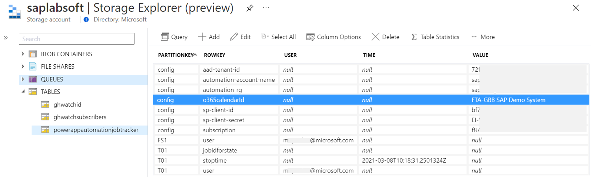
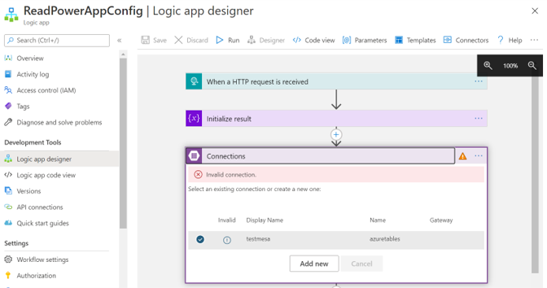
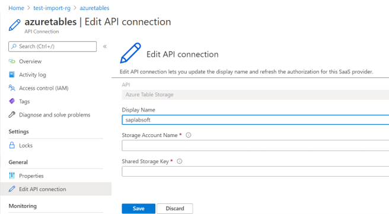

# How to get started with PowerApp for the Start/Stop solution on Azure

Find the blog on the SAP community [here](https://blogs.sap.com/2021/02/10/hey-sap-systems-my-powerapp-says-snooze-but-only-if-youre-ready-yet/).

Series continued on Self-service sign-up process to the App [here](https://blogs.sap.com/2021/03/08/sap-snoozing-just-sign-me-up-already/).

## Prerequisites

- An Azure account with [Goran’s powershell and automation account setup](https://techcommunity.microsoft.com/t5/running-sap-applications-on-the/optimize-your-azure-costs-by-automating-sap-system-start-stop/ba-p/2120675) as well as authority to create the Azure storage account (table storage) and automation account. Azure Resource Manager requires a service principal to securely call the API. [Here](https://blog.jongallant.com/2017/11/azure-rest-apis-postman/) is the reference for Postman, which I re-created with http steps in PowerAutomate. Simply follow the service principal setup and exchange the ids on the table storage.

- Table Storage configuration to store the connection parameters for the Azure REST API calls. Normally you would store these in Azure KeyVault but that makes the PowerAutomate flows less easily sharable. In favor of providing an easy starting point we put them on the table. Feel free to alter afterwards to match your requirements. Furthermore the entries are loaded through LogicApp 'ReadPowerAppConfig' to circumvent Data Loss Prevention Policy in PowerAutomate. Feel free to export/create it as PowerAutomate flow in case you don't have that issue.

    1. o365calendarId: __Name__ of your shared calendar (Id will be extracted by PowerAutomate)
    2. Subscription: Azure subscription id that contains Automation account and Table storage
    3. sp-client-id and *-secret: Credentials for Service Principal configured in section before
    4. automation-rg: Azure resource group, that contains Automation Account
    5. automation-account-name: Automation Account name
    6. aad-tenant-id: Azure AD tenant id, that governs the SAP snoozing instance

    

- Import the LogicApp using template 'ReadPowerAppConfig.json' into Azure using the portal or CLI (search "Deploy a custom template"). You need to open the Table storage connection and maintain the storage account name and access key or create a new one from the LogicApp designer. Finally restrict the ip range of allowed services to call the LogicApp from PowerAutomate (LogicApp -> Workflow settings). Public IPs are listed [here](https://docs.microsoft.com/en-us/power-automate/limits-and-config#ip-addresses) or you could just run first time and check the error message for the ip provided by your PowerAutomate tenant.

    
    

- PowerPlatform account: You might consider the [community plan](https://powerapps.microsoft.com/de-de/communityplan/) if your current subscription does not contain premium connectors or you have no PowerPlatform account at all. You need that for the HTTP connection for instance. One downside would be that community resources cannot be shared, which is essential if you would like to empower anyone to use it 😉 But you might consider this enough for testing the approach for free.

- A separate calendar in Outlook365 for your scheduled SAP systems. Don’t forget to put the name on the Table storage config and make sure every user is invited to the calendar. Otherwise you will see error "Object could not be found in store".

- Import the PowerApp solution package “SAP-SID-Controller.zip” from our GitHub repos into the portal. It contains the cloud flows for PowerAutomate and the PowerApp itself. [Here](https://docs.microsoft.com/en-us/powerapps/maker/canvas-apps/export-import-app#importing-a-canvas-app-package) is a reference with a video on how to do that. During the import process you will need to update connection parameters for Azure AD, the Table Storage, Outlook365 and Azure Resource Manager. To do that it is advisable to create them upfront so you can pick right away. Once imported you need to walk through the cloud flows one by one to update the step "Get PowerApp config" with your own LogicApp URL. 
    
    The three remaining zip files contain the timer based cloud flows to notify users of expiring SAP claims, to stop the scheduled SAP sessions automatically and perform automatic user onboarding to the PowerApp using Microsoft Forms. You will need to import them individually. 

- For those of you that know what they are doing could update the logic app url (marked with placeholder https://<<<your logic app url>>>) on the XML of the flows directly before uploading. This way you don't need to browse the flow for the flow-step. Be aware that you __don't__ alter any formatting (e.g pretty print, line breaks etc) otherwise the import to PowerAutomate will fail!

    