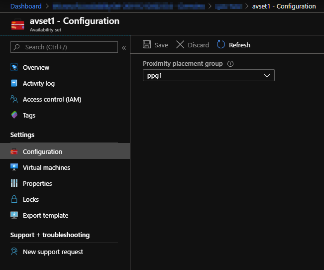

# Move AvSet to Proximity Placement Group

## Proximity Placement Groups (PPGs)

[Proximity Placement Groups](https://docs.microsoft.com/en-us/azure/virtual-machines/windows/proximity-placement-groups) (PPG) is a contruct where Azure tries to keep multiple resources as close together as possible.

The Proximity Placement Group needs to be specified during AvSet creation.

## Moving the AvSet into a Proximity Placement Group (PPG)

**requirements:**

* Azure Subscription

## How To

At the moment there is no option to update the Availability Set from command line, please use the portal to set the configuration:

