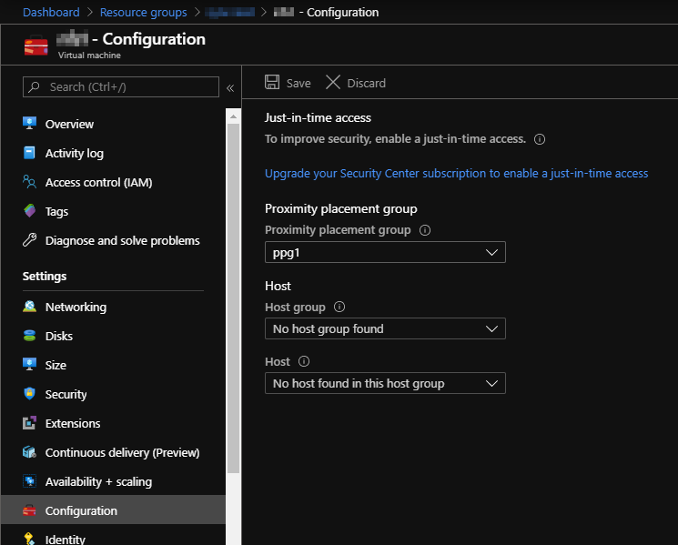

# Move VM to Proximity Placement Group

## Proximity Placement Groups (PPGs)

[Proximity Placement Groups](https://docs.microsoft.com/en-us/azure/virtual-machines/windows/proximity-placement-groups) (PPG) is a contruct where Azure tries to keep multiple resources as close together as possible.

The Proximity Placement Group needs to be specified during VM creation. If you want to move an existing VM into a Proximity Placement Group it is required to recreate the virtual machine.

## Moving the VM into a Proximity Placement Group (PPG)

**requirements:**

* Azure Subscription
* PowerShell 5.1 or newer
* PowerShell module Az

## Option 1 - Script

    $vm = Get-AzVM -name <vmname> -ResourceGroupName <rgname>
    $ppg = Get-AzProximityPlacementGroup -Name <ppgname> -ResourceGroupName <rgnameppg>
    $vm.ProximityPlacementGroup=$ppg.Id
    $vm | Update-AzVM

## Option 2 - GUI

